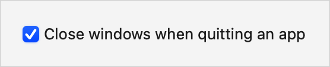

> Navigation: [Technologies](../../technologies.md) · [SwiftUI](../../swiftui.md) · [ToggleStyle](../togglestyle.md)

# checkbox

<sub>Type Property</sub>

A toggle style that displays a checkbox followed by its label.

<sub>macOS</sub>

```swift
@export(implementation) nonisolated static var checkbox: CheckboxToggleStyle { get }
```

## Discussion

Apply this style to a [Toggle](../toggle.md) or to a view hierarchy that contains toggles using the [toggleStyle(_:)](<../view/togglestyle(__).md>) modifier:

```swift
Toggle("Close windows when quitting an app", isOn: $doesClose)
    .toggleStyle(.checkbox)
```

The style produces a label that describes the purpose of the toggle and a checkbox that shows the toggle’s state. To change the toggle’s state, the user clicks the checkbox or its label:



The style aligns the trailing edge of the checkbox with the leading edge of the label, and takes as much horizontal space as it needs to fit the label, up to the amount offered by the toggle’s parent view.

This is the default style in macOS in most contexts when you don’t set a style, or when you apply the [automatic](automatic.md) style. A [Form](../form.md) is a convenient way to present a collection of checkboxes with proper spacing and alignment. For guidance on using checkboxes in your user interface, see [Toggles](../../design/human-interface-guidelines/toggles.md#Checkboxes) in the Human Interface Guidelines.

## See Also

### Getting built-in toggle styles

- [automatic](automatic.md) — The default toggle style.
- [button](button.md) — A toggle style that displays as a button with its label as the title.
- [switch](switch.md) — A toggle style that displays a leading label and a trailing switch.
