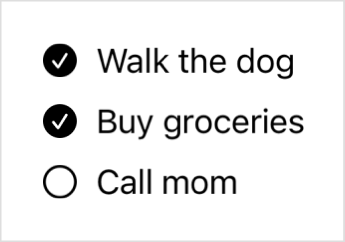
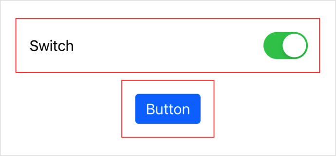

> Navigation: [Technologies](../../technologies.md) · [SwiftUI](../../swiftui.md) · [ToggleStyle](../togglestyle.md)

# makeBody(configuration:)

<sub>Instance Method</sub>

Creates a view that represents the body of a toggle.

<sub>iOS, iPadOS, Mac Catalyst, macOS, tvOS, visionOS, watchOS</sub>

```swift
@ContentBuilder @MainActor @preconcurrency func makeBody(configuration: Self.Configuration) -> Self.Body
```

## Parameters

- `configuration` — The properties of the toggle, including a label and a binding to the toggle’s state.

## Return Value

A view that has behavior and appearance that enables it to function as a [Toggle](../toggle.md).

## Discussion

Implement this method when you define a custom toggle style that conforms to the [ToggleStyle](../togglestyle.md) protocol. Use the `configuration` input — a [ToggleStyleConfiguration](../togglestyleconfiguration.md) instance — to access the toggle’s label and state. Return a view that has the appearance and behavior of a toggle. For example you can create a toggle that displays a label and a circle that’s either empty or filled with a checkmark:

```swift
struct ChecklistToggleStyle: ToggleStyle {
    func makeBody(configuration: Configuration) -> some View {
        Button {
            configuration.isOn.toggle()
        } label: {
            HStack {
                Image(systemName: configuration.isOn
                        ? "checkmark.circle.fill"
                        : "circle")
                configuration.label
            }
        }
        .tint(.primary)
        .buttonStyle(.borderless)
    }
}
```

The `ChecklistToggleStyle` toggle style provides a way to both observe and modify the toggle state: the circle fills for the on state, and users can tap or click the toggle to change the state. By using a customized [Button](../button.md) to compose the toggle’s body, SwiftUI automatically provides the behaviors that users expect from a control that has button-like characteristics.

You can present a collection of toggles that use this style in a stack:



When updating a view hierarchy, the system calls your implementation of the `makeBody(configuration:)` method for each [Toggle](../toggle.md) instance that uses the associated style.

### Modify the current style

Rather than create an entirely new style, you can alternatively modify a toggle’s current style. Use the [init(_:)](<../toggle/init(__).md>) initializer inside the `makeBody(configuration:)` method to create and modify a toggle based on a `configuration` value. For example, you can create a style that adds padding and a red border to the current style:

```swift
struct RedBorderToggleStyle: ToggleStyle {
    func makeBody(configuration: Configuration) -> some View {
        Toggle(configuration)
            .padding()
            .border(.red)
    }
}
```

If you create a `redBorder` static variable from this style, you can apply the style to toggles that already use another style, like the built-in [switch](switch.md) and [button](button.md) styles:

```swift
Toggle("Switch", isOn: $isSwitchOn)
    .toggleStyle(.redBorder)
    .toggleStyle(.switch)

Toggle("Button", isOn: $isButtonOn)
    .toggleStyle(.redBorder)
    .toggleStyle(.button)
```

Both toggles appear with the usual styling, each with a red border:



Apply the custom style closer to the toggle than the modified style because SwiftUI evaluates style view modifiers in order from outermost to innermost. If you apply the styles in the other order, the red border style doesn’t have an effect, because the built-in styles override it completely.

## See Also

### Creating custom toggle styles

- [ToggleStyleConfiguration](../togglestyleconfiguration.md) — The properties of a toggle instance.
- [Configuration](configuration.md) — The properties of a toggle instance.
- [Body](body.md) — A view that represents the appearance and interaction of a toggle.
