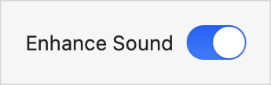
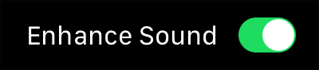
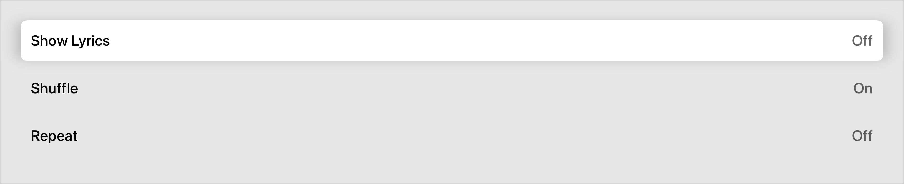

> Navigation: [Technologies](../../technologies.md) · [SwiftUI](../../swiftui.md) · [ToggleStyle](../togglestyle.md)

# switch

<sub>Type Property</sub>

A toggle style that displays a leading label and a trailing switch.

<sub>iOS, iPadOS, Mac Catalyst, macOS, tvOS, visionOS, watchOS</sub>

```swift
@export(implementation) nonisolated static var `switch`: SwitchToggleStyle { get }
```

## Discussion

Apply this style to a [Toggle](../toggle.md) or to a view hierarchy that contains toggles using the [toggleStyle(_:)](<../view/togglestyle(__).md>) modifier:

```swift
Toggle("Enhance Sound", isOn: $isEnhanced)
    .toggleStyle(.switch)
```

The style produces a label that describes the purpose of the toggle and a switch that shows the toggle’s state. The user taps or clicks the switch to change the toggle’s state. The default appearance is similar across platforms, although the way you use switches in your user interface varies a little, as described in [Toggles](../../design/human-interface-guidelines/toggles.md) in the Human Interface Guidelines.

**iOS**


<sub>A screenshot of the text On appearing to the left of a toggle switch that's on. The toggle's tint color is green. The toggle and its text appear in a rounded rectangle, and are aligned with opposite edges of the rectangle.</sub>

**macOS**



<sub>A screenshot of the text On appearing to the left of a toggle switch that's on. The toggle's tint color is blue. The toggle and its text are adjacent to each other.</sub>

**watchOS**



<sub>A screenshot of the text On appearing to the left of a toggle switch that's on. The toggle's tint color is green. The toggle and its text appear in a rounded rectangle, and are aligned with opposite edges of the rectangle.</sub>

**tvOS**



<sub>A screenshot of three buttons labeled Show Lyrics, Shuffle, and Repeat, stacked vertically. The first is highlighted. The second is on, while the others are off.</sub>

In iOS, iPadOS, watchOS, and tvOS, the label and switch fill as much horizontal space as the toggle’s parent offers by aligning the label’s leading edge and the switch’s trailing edge with the containing view’s respective leading and trailing edges. In macOS, the style uses a minimum of horizontal space by aligning the trailing edge of the label with the leading edge of the switch. SwiftUI helps you to manage the spacing and alignment when this style appears in a [Form](../form.md).

SwiftUI uses this style as the default for iOS, iPadOS, watchOS, and tvOS in most contexts when you don’t set a style, or when you apply the [automatic](automatic.md) style.

## See Also

### Getting built-in toggle styles

- [automatic](automatic.md) — The default toggle style.
- [button](button.md) — A toggle style that displays as a button with its label as the title.
- [checkbox](checkbox.md) — A toggle style that displays a checkbox followed by its label.
