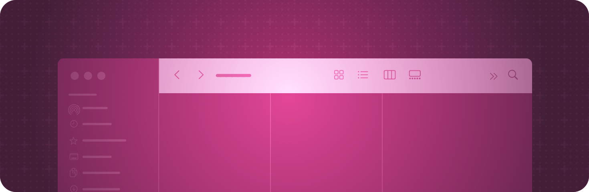

> Navigation: [Technologies](../technologies.md) · [SwiftUI](../swiftui.md)

# Toolbars

API Collection

Provide immediate access to frequently used commands and controls.

## Overview

The system might present toolbars above or below your app’s content, depending on the platform and the context.

Add items to a toolbar by applying the [toolbar(content:)](<view/toolbar(content_).md>) view modifier to a view in your app. You can also configure the toolbar using view modifiers. For example, you can set the visibility of a toolbar with the [toolbar(_:for:)](<view/toolbar(__for_).md>) modifier.

For design guidance, see [Toolbars](../design/human-interface-guidelines/toolbars.md) in the Human Interface Guidelines.

## Topics

### Populating a toolbar

- [toolbar(content:)](<view/toolbar(content_).md>) — Populates the toolbar or navigation bar with the specified items.
- [ToolbarItem](toolbaritem.md) — A model that represents an item which can be placed in the toolbar or navigation bar.
- [ToolbarItemGroup](toolbaritemgroup.md) — A model that represents a group of `ToolbarItem`s which can be placed in the toolbar or navigation bar.
- [ToolbarItemPlacement](toolbaritemplacement.md) — A structure that defines the placement of a toolbar item.
- [toolbarOverflowMenu(content:)](<view/toolbaroverflowmenu(content_).md>) — Configures the overflow menu of a toolbar. _(beta)_
- [ToolbarOverflowMenu](toolbaroverflowmenu.md) — The overflow menu of a toolbar. _(beta)_
- [ToolbarContent](toolbarcontent.md) — Conforming types represent items that can be placed in various locations in a toolbar.
- [ToolbarContentBuilder](toolbarcontentbuilder.md) — Constructs a toolbar item set from multi-expression closures.
- [ToolbarSpacer](toolbarspacer.md) — A standard space item in toolbars.
- [DefaultToolbarItem](defaulttoolbaritem.md) — A toolbar item that represents a system component.

### Populating a customizable toolbar

- [toolbar(id:content:)](<view/toolbar(id_content_).md>) — Populates the toolbar or navigation bar with the specified items, allowing for user customization.
- [toolbarItemHidden(_:)](<view/toolbaritemhidden(__).md>) — Hides an individual view within a control group toolbar item.
- [CustomizableToolbarContent](customizabletoolbarcontent.md) — Conforming types represent items that can be placed in various locations in a customizable toolbar.
- [ToolbarCustomizationBehavior](toolbarcustomizationbehavior.md) — The customization behavior of customizable toolbar content.
- [ToolbarCustomizationOptions](toolbarcustomizationoptions.md) — Options that influence the default customization behavior of customizable toolbar content.
- [SearchToolbarBehavior](searchtoolbarbehavior.md) — The behavior of a search field in a toolbar.

### Removing default items

- [toolbar(removing:)](<view/toolbar(removing_).md>) — Remove a toolbar item present by default
- [ToolbarDefaultItemKind](toolbardefaultitemkind.md) — A kind of toolbar item a `View` adds by default.

### Setting toolbar visibility

- [toolbar(_:for:)](<view/toolbar(__for_).md>) — Specifies the visibility of a bar managed by SwiftUI.
- [toolbarVisibility(_:for:)](<view/toolbarvisibility(__for_).md>) — Specifies the visibility of a bar managed by SwiftUI.
- [toolbarBackgroundVisibility(_:for:)](<view/toolbarbackgroundvisibility(__for_).md>) — Specifies the preferred visibility of backgrounds on a bar managed by SwiftUI.
- [ToolbarPlacement](toolbarplacement.md) — The placement of a toolbar.
- [ContentToolbarPlacement](contenttoolbarplacement.md)

### Specifying the role of toolbar content

- [toolbarRole(_:)](<view/toolbarrole(__).md>) — Configures the semantic role for the content populating the toolbar.
- [ToolbarRole](toolbarrole.md) — The purpose of content that populates the toolbar.

### Styling a toolbar

- [toolbarBackground(_:for:)](<view/toolbarbackground(__for_).md>) — Specifies the preferred shape style of the background of a bar managed by SwiftUI.
- [toolbarColorScheme(_:for:)](<view/toolbarcolorscheme(__for_).md>) — Specifies the preferred color scheme of a bar managed by SwiftUI.
- [toolbarForegroundStyle(_:for:)](<view/toolbarforegroundstyle(__for_).md>) — Specifies the preferred foreground style of bars managed by SwiftUI.
- [windowToolbarStyle(_:)](<scene/windowtoolbarstyle(__).md>) — Sets the style for the toolbar defined within this scene.
- [WindowToolbarStyle](windowtoolbarstyle.md) — A specification for the appearance and behavior of a window’s toolbar.
- [toolbarLabelStyle](environmentvalues/toolbarlabelstyle.md) — The label style to apply to controls within a toolbar.
- [ToolbarLabelStyle](toolbarlabelstyle.md) — The label style of a toolbar.
- [SpacerSizing](spacersizing.md) — A type which defines how spacers should size themselves.

### Configuring the toolbar title display mode

- [toolbarTitleDisplayMode(_:)](<view/toolbartitledisplaymode(__).md>) — Configures the toolbar title display mode for this view.
- [ToolbarTitleDisplayMode](toolbartitledisplaymode.md) — A type that defines the behavior of title of a toolbar.

### Setting the toolbar title menu

- [toolbarTitleMenu(content:)](<view/toolbartitlemenu(content_).md>) — Configure the title menu of a toolbar.
- [ToolbarTitleMenu](toolbartitlemenu.md) — The title menu of a toolbar.

### Creating an ornament

- [ornament(visibility:attachmentAnchor:contentAlignment:ornament:)](<view/ornament(visibility_attachmentanchor_contentalignment_ornament_).md>) — Presents an ornament.
- [OrnamentAttachmentAnchor](ornamentattachmentanchor.md) — An attachment anchor for an ornament.

### Controlling item visibility

- [visibilityPriority(_:)](<toolbarcontent/visibilitypriority(__).md>) — Defines the visibility priority for a toolbar item.
- [ToolbarItemVisibilityPriority](toolbaritemvisibilitypriority.md) — A value that defines the visibility priority of a toolbar item.

### Minimizing a toolbar

- [toolbarMinimizationBehavior(_:for:)](<view/toolbarminimizationbehavior(__for_).md>) — Sets the minimize behavior for the specified bars. _(beta)_
- [ToolbarMinimizationBehavior](toolbarminimizationbehavior.md) — The minimization behavior of a toolbar. _(beta)_
- [toolbarMinimizationRestoration(_:for:)](<view/toolbarminimizationrestoration(__for_).md>) — Sets the restoration behavior for the specified bars during minimization. _(beta)_
- [ToolbarMinimizationRestoration](toolbarminimizationrestoration.md) — The restoration behavior during toolbar minimization. _(beta)_
- [toolbarMinimizationSafeAreaAdjustment(_:for:)](<view/toolbarminimizationsafeareaadjustment(__for_).md>) — Sets the safe area adjustment for the specified bars during minimization. _(beta)_
- [ToolbarMinimizationSafeAreaAdjustment](toolbarminimizationsafeareaadjustment.md) — The safe area adjustment during toolbar minimization. _(beta)_

## See Also

### App structure

- [App organization](app-organization.md) — Define the entry point and top-level structure of your app.
- [Scenes](scenes.md) — Declare the user interface groupings that make up the parts of your app.
- [Windows](windows.md) — Display user interface content in a window or a collection of windows.
- [Immersive spaces](immersive-spaces.md) — Display unbounded content in a person’s surroundings.
- [Documents](documents.md) — Enable people to open and manage documents.
- [Navigation](navigation.md) — Enable people to move between different parts of your app’s view hierarchy within a scene.
- [Modal presentations](modal-presentations.md) — Present content in a separate view that offers focused interaction.
- [Search](search.md) — Enable people to search for text or other content within your app.
- [App extensions](app-extensions.md) — Extend your app’s basic functionality to other parts of the system, like by adding a Widget.
