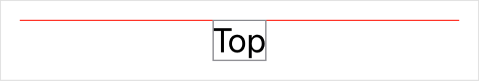

> Navigation: [Technologies](../../technologies.md) · [SwiftUI](../../swiftui.md) · [VerticalAlignment](../verticalalignment.md)

# top

<sub>Type Property</sub>

A guide that marks the top edge of the view.

<sub>iOS, iPadOS, Mac Catalyst, macOS, tvOS, visionOS, watchOS</sub>

```swift
static let top: VerticalAlignment
```

## Discussion

Use this guide to align the top edges of views:



The following code generates the image above using an [HStack](../hstack.md):

```swift
struct VerticalAlignmentTop: View {
    var body: some View {
        HStack(alignment: .top, spacing: 0) {
            Color.red.frame(height: 1)
            Text("Top").font(.title).border(.gray)
            Color.red.frame(height: 1)
        }
    }
}
```

## See Also

### Getting guides

- [center](center.md) — A guide that marks the vertical center of the view.
- [bottom](bottom.md) — A guide that marks the bottom edge of the view.
- [firstTextBaseline](firsttextbaseline.md) — A guide that marks the top-most text baseline in a view.
- [lastTextBaseline](lasttextbaseline.md) — A guide that marks the bottom-most text baseline in a view.
