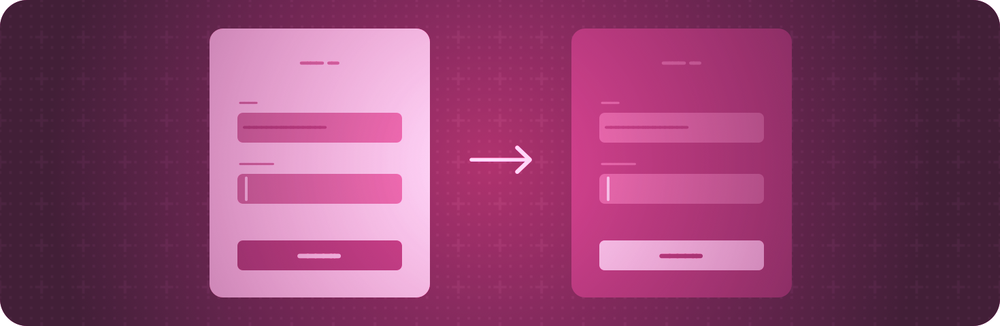

> Navigation: [Technologies](../technologies.md) · [SwiftUI](../swiftui.md)

# View configuration

API Collection

Adjust the characteristics of views in a hierarchy.

## Overview

SwiftUI enables you to tune the appearance and behavior of views using view modifiers.

Many modifiers apply to specific kinds of views or behaviors, but some apply more generally. For example, you can conditionally hide any view by dynamically setting its opacity, display contextual help when people hover over a view, or request the light or dark appearance for a view.

## Topics

### Hiding views

- [opacity(_:)](<view/opacity(__).md>) — Sets the transparency of this view.
- [hidden()](<view/hidden().md>) — Hides this view unconditionally.

### Hiding system elements

- [labelsHidden()](<view/labelshidden().md>) — Hides the labels of any controls contained within this view.
- [labelsVisibility(_:)](<view/labelsvisibility(__).md>) — Controls the visibility of labels of any controls contained within this view.
- [labelsVisibility](environmentvalues/labelsvisibility.md) — The labels visibility set by [labelsVisibility(_:)](<view/labelsvisibility(__).md>).
- [menuIndicator(_:)](<view/menuindicator(__).md>) — Sets the menu indicator visibility for controls within this view.
- [statusBarHidden(_:)](<view/statusbarhidden(__).md>) — Sets the visibility of the status bar. _(deprecated)_
- [persistentSystemOverlays(_:)](<view/persistentsystemoverlays(__).md>) — Sets the preferred visibility of the non-transient system views overlaying the app.
- [Visibility](visibility.md) — The visibility of a UI element, chosen automatically based on the platform, current context, and other factors.

### Managing view interaction

- [disabled(_:)](<view/disabled(__).md>) — Adds a condition that controls whether users can interact with this view.
- [isEnabled](environmentvalues/isenabled.md) — A Boolean value that indicates whether the view associated with this environment allows user interaction.
- [interactionActivityTrackingTag(_:)](<view/interactionactivitytrackingtag(__).md>) — Sets a tag that you use for tracking interactivity.
- [invalidatableContent(_:)](<view/invalidatablecontent(__).md>) — Mark the receiver as their content might be invalidated.

### Providing contextual help

- [help(_:)](<view/help(__).md>) — Adds help text to a view using a localized string resource that you provide.

### Detecting and requesting the light or dark appearance

- [preferredColorScheme(_:)](<view/preferredcolorscheme(__).md>) — Sets the preferred color scheme for this presentation.
- [colorScheme](environmentvalues/colorscheme.md) — The color scheme of this environment.
- [ColorScheme](colorscheme.md) — The possible color schemes, corresponding to the light and dark appearances.

### Getting the color scheme contrast

- [colorSchemeContrast](environmentvalues/colorschemecontrast.md) — The contrast associated with the color scheme of this environment.
- [ColorSchemeContrast](colorschemecontrast.md) — The contrast between the app’s foreground and background colors.

### Configuring passthrough

- [preferredSurroundingsEffect(_:)](<view/preferredsurroundingseffect(__).md>) — Applies an effect to passthrough video.
- [SurroundingsEffect](surroundingseffect.md) — Effects that the system can apply to passthrough video.
- [breakthroughEffect(_:)](<view/breakthrougheffect(__).md>) — Ensures that the view is always visible to the user, even when other content is occluding it, like 3D models.
- [BreakthroughEffect](breakthrougheffect.md)

### Redacting private content

- [Designing your app for the Always On state](../watchos-apps/designing-your-app-for-the-always-on-state.md) — Customize your watchOS app’s user interface for continuous display.
- [Protecting sensitive content when screen sharing and remote control are active](protecting-sensitive-content-when-screen-sharing.md) — Detect active screen capture sessions and respond appropriately to protect sensitive content in your app.
- [privacySensitive(_:)](<view/privacysensitive(__).md>) — Marks the view as containing sensitive, private user data.
- [redacted(reason:)](<view/redacted(reason_).md>) — Adds a reason to apply a redaction to this view hierarchy.
- [unredacted()](<view/unredacted().md>) — Removes any reason to apply a redaction to this view hierarchy.
- [redactionReasons](environmentvalues/redactionreasons.md) — The current redaction reasons applied to the view hierarchy.
- [isSceneCaptured](environmentvalues/isscenecaptured.md) — The current capture state.
- [RedactionReasons](redactionreasons.md) — The reasons to apply a redaction to data displayed on screen.

## See Also

### Views

- [View fundamentals](view-fundamentals.md) — Define the visual elements of your app using a hierarchy of views.
- [View styles](view-styles.md) — Apply built-in and custom appearances and behaviors to different types of views.
- [Animations](animations.md) — Create smooth visual updates in response to state changes.
- [Text input and output](text-input-and-output.md) — Display formatted text and get text input from the user.
- [Images](images.md) — Add images and symbols to your app’s user interface.
- [Controls and indicators](controls-and-indicators.md) — Display values and get user selections.
- [Menus and commands](menus-and-commands.md) — Provide space-efficient, context-dependent access to commands and controls.
- [Shapes](shapes.md) — Trace and fill built-in and custom shapes with a color, gradient, or other pattern.
- [Drawing and graphics](drawing-and-graphics.md) — Enhance your views with graphical effects and customized drawings.
