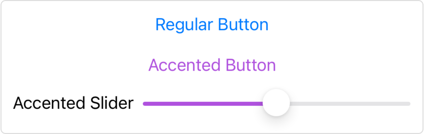

> Navigation: [Technologies](../../technologies.md) · [SwiftUI](../../swiftui.md) · [View](../view.md)

# accentColor(_:)

<sub>Instance Method</sub>

Sets the accent color for this view and the views it contains.

> [!warning] Deprecated
> Use the asset catalog’s accent color or [tint(_:)](<tint(__)-93mfq.md>) instead.

<sub>iOS, iPadOS, Mac Catalyst, macOS, tvOS, visionOS, watchOS</sub>

```swift
nonisolated func accentColor(_ accentColor: Color?) -> some View

```

## Parameters

- `accentColor` — The color to use as an accent color. Set the value to `nil` to use the inherited accent color.

## Discussion

Use `accentColor(_:)` when you want to apply a broad theme color to your app’s user interface. Some styles of controls use the accent color as a default tint color.

> [!note] Note
> In macOS, SwiftUI applies customization of the accent color only if the user chooses Multicolor under General \> Accent color in System Preferences.

In the example below, the outer [VStack](../vstack.md) contains two child views. The first is a button with the default accent color. The second is a [VStack](../vstack.md) that contains a button and a slider, both of which adopt the purple accent color of their containing view. Note that the [Text](../text.md) element used as a label alongside the `Slider` retains its default color.

```swift
VStack(spacing: 20) {
    Button(action: {}) {
        Text("Regular Button")
    }
    VStack {
        Button(action: {}) {
            Text("Accented Button")
        }
        HStack {
            Text("Accented Slider")
            Slider(value: $sliderValue, in: -100...100, step: 0.1)
        }
    }
    .accentColor(.purple)
}
```



<sub>A VStack showing two child views: one VStack containing a default accented button, and a second VStack where the VStack has a purple accent color applied. The accent color modifies the enclosed button and slider, but not the color of a Text item used as a label for the slider.</sub>

## See Also

### Graphics and rendering modifiers

- [mask(_:)](<mask(__).md>) — Masks this view using the alpha channel of the given view. _(deprecated)_
- [animation(_:)](<animation(__)-1hc0p.md>) — Applies the given animation to all animatable values within this view. _(deprecated)_
- [cornerRadius(_:antialiased:)](<cornerradius(__antialiased_).md>) — Clips this view to its bounding frame, with the specified corner radius. _(deprecated)_
