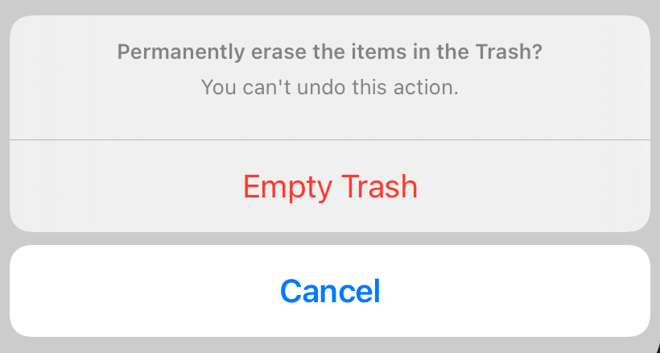

> Navigation: [Technologies](../../technologies.md) · [SwiftUI](../../swiftui.md) · [View](../view.md)

# actionSheet(isPresented:content:)

<sub>Instance Method</sub>

Presents an action sheet when a given condition is true.

> [!warning] Deprecated
> Use [confirmationDialog(_:isPresented:titleVisibility:actions:message:)](<confirmationdialog(__ispresented_titlevisibility_actions_message_)-2s7pz.md>) instead.

<sub>iOS, iPadOS, Mac Catalyst, tvOS, visionOS, watchOS</sub>

```swift
nonisolated func actionSheet(isPresented: Binding<Bool>, content: () -> ActionSheet) -> some View

```

## Parameters

- `isPresented` — A binding to a Boolean value that determines whether to present the action sheet that you create in the modifier’s `content` closure. When the user presses or taps the sheet’s default action button the system sets this value to `false` dismissing the sheet.

- `content` — A closure returning the `ActionSheet` to present.

## Discussion

In the example below, a button conditionally presents an action sheet depending upon the value of a bound Boolean variable. When the Boolean value is set to `true`, the system displays an action sheet with both destructive and default actions:

```swift
struct ConfirmEraseItems: View {
    @State private var isShowingSheet = false
    var body: some View {
        Button("Show Action Sheet", action: {
            isShowingSheet = true
        })
        .actionSheet(isPresented: $isShowingSheet) {
            ActionSheet(
                title: Text("Permanently erase the items in the Trash?"),
                message: Text("You can't undo this action."),
                buttons:[
                    .destructive(Text("Empty Trash"),
                                 action: emptyTrashAction),
                    .cancel()
                ]
            )}
    }

    func emptyTrashAction() {
        // Handle empty trash action.
    }
}
```



> [!note] Note
> In regular size classes in iOS, the system renders alert sheets as a popover that the user dismisses by tapping anywhere outside the popover, rather than displaying the default dismiss button.

## See Also

### View presentation modifiers

- [actionSheet(item:content:)](<actionsheet(item_content_).md>) — Presents an action sheet using the given item as a data source for the sheet’s content. _(deprecated)_
- [alert(isPresented:content:)](<alert(ispresented_content_).md>) — Presents an alert to the user. _(deprecated)_
- [alert(item:content:)](<alert(item_content_).md>) — Presents an alert to the user. _(deprecated)_
