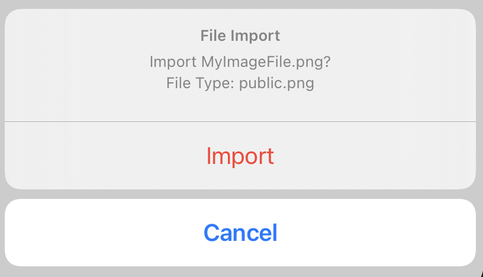

> Navigation: [Technologies](../../technologies.md) · [SwiftUI](../../swiftui.md) · [View](../view.md)

# actionSheet(item:content:)

<sub>Instance Method</sub>

Presents an action sheet using the given item as a data source for the sheet’s content.

> [!warning] Deprecated
> Use [confirmationDialog(_:isPresented:titleVisibility:presenting:actions:message:)](<confirmationdialog(__ispresented_titlevisibility_presenting_actions_message_)-8y541.md>) instead.

<sub>iOS, iPadOS, Mac Catalyst, tvOS, visionOS, watchOS</sub>

```swift
nonisolated func actionSheet<T>(item: Binding<T?>, content: (T) -> ActionSheet) -> some View where T : Identifiable

```

## Parameters

- `item` — A binding to an optional source of truth for the action sheet. When `item` is non-`nil`, the system passes the contents to the modifier’s closure. You use this content to populate the fields of an action sheet that you create that the system displays to the user. If `item` changes, the system dismisses the currently displayed action sheet and replaces it with a new one using the same process.

- `content` — A closure returning the [ActionSheet](../actionsheet.md) you create.

## Discussion

Use this method when you need to populate the fields of an action sheet with content from a data source. The example below shows a custom data source, `FileDetails`, that provides data to populate the action sheet:

```swift
struct FileDetails: Identifiable {
    var id: String { name }
    let name: String
    let fileType: UTType
}
struct ConfirmFileImport: View {
    @State private var sheetDetail: FileDetails?
    var body: some View {
        Button("Show Action Sheet") {
            sheetDetail = FileDetails(name: "MyImageFile.png",
                                      fileType: .png)
        }
        .actionSheet(item: $sheetDetail) { detail in
            ActionSheet(
                title: Text("File Import"),
                message: Text("""
                         Import \(detail.name)?
                         File Type: \(detail.fileType.description)
                         """),
                buttons: [
                    .destructive(Text("Import"),
                                 action: importFile),
                    .cancel()
                ])
        }
    }

    func importFile() {
        // Handle import action.
    }
}
```



## See Also

### View presentation modifiers

- [actionSheet(isPresented:content:)](<actionsheet(ispresented_content_).md>) — Presents an action sheet when a given condition is true. _(deprecated)_
- [alert(isPresented:content:)](<alert(ispresented_content_).md>) — Presents an alert to the user. _(deprecated)_
- [alert(item:content:)](<alert(item_content_).md>) — Presents an alert to the user. _(deprecated)_
