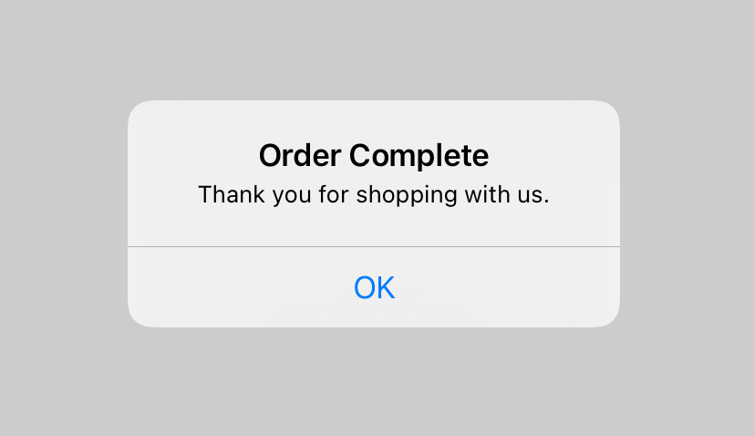

> Navigation: [Technologies](../../technologies.md) · [SwiftUI](../../swiftui.md) · [View](../view.md)

# alert(isPresented:content:)

<sub>Instance Method</sub>

Presents an alert to the user.

> [!warning] Deprecated
> Use [alert(_:isPresented:actions:message:)](<alert(__ispresented_actions_message_)-6awwp.md>) instead.

<sub>iOS, iPadOS, Mac Catalyst, macOS, tvOS, visionOS, watchOS</sub>

```swift
nonisolated func alert(isPresented: Binding<Bool>, content: () -> Alert) -> some View

```

## Parameters

- `isPresented` — A binding to a Boolean value that determines whether to present the alert that you create in the modifier’s `content` closure. When the user presses or taps OK the system sets `isPresented` to `false` which dismisses the alert.

- `content` — A closure returning the alert to present.

## Discussion

Use this method when you need to show an alert to the user. The example below displays an alert that is shown when the user toggles a Boolean value that controls the presentation of the alert:

```swift
struct OrderCompleteAlert: View {
    @State private var isPresented = false
    var body: some View {
        Button("Show Alert", action: {
            isPresented = true
        })
        .alert(isPresented: $isPresented) {
            Alert(title: Text("Order Complete"),
                  message: Text("Thank you for shopping with us."),
                  dismissButton: .default(Text("OK")))
        }
    }
}
```



<sub>An alert whose title reads Order Complete, with the message, Thank you for shopping with us placed underneath. The alert also includes an OK button for dismissing the alert.</sub>

## See Also

### View presentation modifiers

- [actionSheet(isPresented:content:)](<actionsheet(ispresented_content_).md>) — Presents an action sheet when a given condition is true. _(deprecated)_
- [actionSheet(item:content:)](<actionsheet(item_content_).md>) — Presents an action sheet using the given item as a data source for the sheet’s content. _(deprecated)_
- [alert(item:content:)](<alert(item_content_).md>) — Presents an alert to the user. _(deprecated)_
