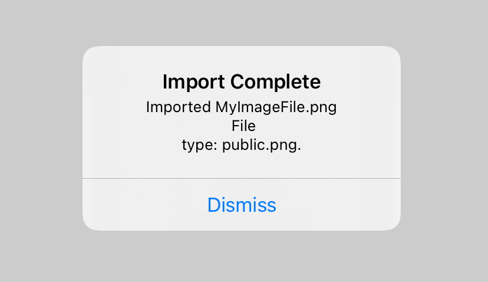

> Navigation: [Technologies](../../technologies.md) · [SwiftUI](../../swiftui.md) · [View](../view.md)

# alert(item:content:)

<sub>Instance Method</sub>

Presents an alert to the user.

> [!warning] Deprecated
> Use [alert(_:isPresented:presenting:actions:message:)](<alert(__ispresented_presenting_actions_message_)-29bp4.md>) instead.

<sub>iOS, iPadOS, Mac Catalyst, macOS, tvOS, visionOS, watchOS</sub>

```swift
nonisolated func alert<Item>(item: Binding<Item?>, content: (Item) -> Alert) -> some View where Item : Identifiable

```

## Parameters

- `item` — A binding to an optional source of truth for the alert. if `item` is non-`nil`, the system passes the contents to the modifier’s closure. You use this content to populate the fields of an alert that you create that the system displays to the user. If `item` changes, the system dismisses the currently displayed alert and replaces it with a new one using the same process.

- `content` — A closure returning the alert to present.

## Discussion

Use this method when you need to show an alert that contains information from a binding to an optional data source that you provide. The example below shows a custom data source `FileInfo` whose properties configure the alert’s `message` field:

```swift
struct FileInfo: Identifiable {
    var id: String { name }
    let name: String
    let fileType: UTType
}

struct ConfirmImportAlert: View {
    @State private var alertDetails: FileInfo?
    var body: some View {
        Button("Show Alert") {
            alertDetails = FileInfo(name: "MyImageFile.png",
                                    fileType: .png)
        }
        .alert(item: $alertDetails) { details in
            Alert(title: Text("Import Complete"),
                  message: Text("""
                    Imported \(details.name) \n File
                    type: \(details.fileType.description).
                    """),
                  dismissButton: .default(Text("Dismiss")))
        }
    }
}
```



<sub>An alert showing information from a data source that describes the result of a file import process. The alert displays the name of the file imported, MyImageFile.png and its file type, the PNG image file format along with a default OK button for dismissing the alert.</sub>

## See Also

### View presentation modifiers

- [actionSheet(isPresented:content:)](<actionsheet(ispresented_content_).md>) — Presents an action sheet when a given condition is true. _(deprecated)_
- [actionSheet(item:content:)](<actionsheet(item_content_).md>) — Presents an action sheet using the given item as a data source for the sheet’s content. _(deprecated)_
- [alert(isPresented:content:)](<alert(ispresented_content_).md>) — Presents an alert to the user. _(deprecated)_
