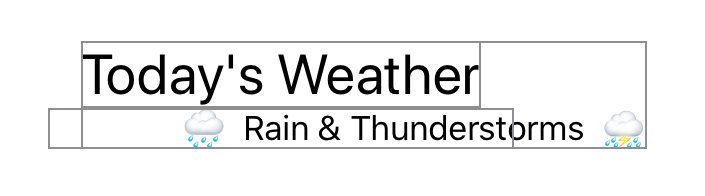

> Navigation: [Technologies](../../technologies.md) · [SwiftUI](../../swiftui.md) · [View](../view.md)

# alignmentGuide(_:computeValue:)

<sub>Instance Method</sub>

Sets the view’s horizontal alignment.

<sub>iOS, iPadOS, Mac Catalyst, macOS, tvOS, visionOS, watchOS</sub>

```swift
@preconcurrency nonisolated func alignmentGuide(_ g: HorizontalAlignment, computeValue: @escaping @Sendable (ViewDimensions) -> CGFloat) -> some View

```

## Parameters

- `g` — A [HorizontalAlignment](../horizontalalignment.md) value at which to base the offset.

- `computeValue` — A closure that returns the offset value to apply to this view.

## Return Value

A view modified with respect to its horizontal alignment according to the computation performed in the method’s closure.

## Discussion

Use `alignmentGuide(_:computeValue:)` to calculate specific offsets to reposition views in relationship to one another. You can return a constant or can use the [ViewDimensions](../viewdimensions.md) argument to the closure to calculate a return value.

In the example below, the [HStack](../hstack.md) is offset by a constant of 50 points to the right of center:

```swift
VStack {
    Text("Today's Weather")
        .font(.title)
        .border(.gray)
    HStack {
        Text("🌧")
        Text("Rain & Thunderstorms")
        Text("⛈")
    }
    .alignmentGuide(HorizontalAlignment.center) { _ in  50 }
    .border(.gray)
}
.border(.gray)
```

Changing the alignment of one view may have effects on surrounding views. Here the offset values inside a stack and its contained views is the difference of their absolute offsets.



## See Also

### Aligning views

- [Aligning views within a stack](../aligning-views-within-a-stack.md) — Position views inside a stack using alignment guides.
- [Aligning views across stacks](../aligning-views-across-stacks.md) — Create a custom alignment and use it to align views across multiple stacks.
- [Alignment](../alignment.md) — An alignment in both axes.
- [HorizontalAlignment](../horizontalalignment.md) — An alignment position along the horizontal axis.
- [VerticalAlignment](../verticalalignment.md) — An alignment position along the vertical axis.
- [DepthAlignment](../depthalignment.md) — An alignment position along the depth axis.
- [AlignmentID](../alignmentid.md) — A type that you use to create custom alignment guides.
- [ViewDimensions](../viewdimensions.md) — A view’s size and alignment guides in its own coordinate space.
- [ViewDimensions3D](../viewdimensions3d.md) — A view’s 3D size and alignment guides in its own coordinate space.
- [SpatialContainer](../spatialcontainer.md) — A layout container that aligns overlapping content in 3D space.
