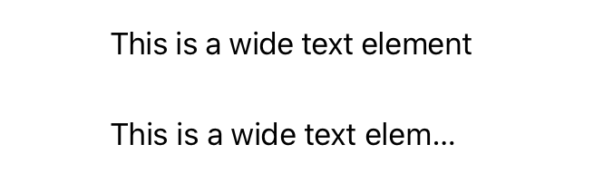

> Navigation: [Technologies](../../technologies.md) · [SwiftUI](../../swiftui.md) · [View](../view.md)

# allowsTightening(_:)

<sub>Instance Method</sub>

Sets whether text in this view can compress the space between characters when necessary to fit text in a line.

<sub>iOS, iPadOS, Mac Catalyst, macOS, tvOS, visionOS, watchOS</sub>

```swift
nonisolated func allowsTightening(_ flag: Bool) -> some View

```

## Parameters

- `flag` — A Boolean value that indicates whether the space between characters compresses when necessary.

## Return Value

A view that can compress the space between characters when necessary to fit text in a line.

## Discussion

Use `allowsTightening(_:)` to enable the compression of inter-character spacing of text in a view to try to fit the text in the view’s bounds.

In the example below, two identically configured text views show the effects of `allowsTightening(_:)` on the compression of the spacing between characters:

```swift
VStack {
    Text("This is a wide text element")
        .font(.body)
        .frame(width: 200, height: 50, alignment: .leading)
        .lineLimit(1)
        .allowsTightening(true)

    Text("This is a wide text element")
        .font(.body)
        .frame(width: 200, height: 50, alignment: .leading)
        .lineLimit(1)
        .allowsTightening(false)
}
```



## See Also

### Controlling hit testing

- [contentShape(_:eoFill:)](<contentshape(__eofill_).md>) — Defines the content shape for hit testing.
- [contentShape(_:_:eoFill:)](<contentshape(____eofill_).md>) — Sets the content shape for this view.
- [ContentShapeKinds](../contentshapekinds.md) — A kind for the content shape of a view.
