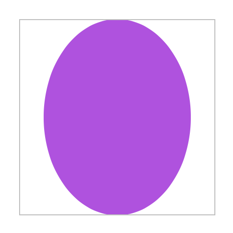

> Navigation: [Technologies](../../technologies.md) · [SwiftUI](../../swiftui.md) · [View](../view.md)

# aspectRatio(_:contentMode:)

<sub>Instance Method</sub>

Constrains this view’s dimensions to the specified aspect ratio.

<sub>iOS, iPadOS, Mac Catalyst, macOS, tvOS, visionOS, watchOS</sub>

```swift
nonisolated func aspectRatio(_ aspectRatio: CGFloat? = nil, contentMode: ContentMode) -> some View

```

## Parameters

- `aspectRatio` — The ratio of width to height to use for the resulting view. Use `nil` to maintain the current aspect ratio in the resulting view.

- `contentMode` — A flag that indicates whether this view fits or fills the parent context.

## Return Value

A view that constrains this view’s dimensions to the aspect ratio of the given size using `contentMode` as its scaling algorithm.

## Discussion

Use `aspectRatio(_:contentMode:)` to constrain a view’s dimensions to an aspect ratio specified by a [CGFloat](../../corefoundation/cgfloat-swift.struct.md) using the specified content mode.

If this view is resizable, the resulting view will have `aspectRatio` as its aspect ratio. In this example, the purple ellipse has a 3:4 width-to-height ratio, and scales to fit its frame:

```swift
Ellipse()
    .fill(Color.purple)
    .aspectRatio(0.75, contentMode: .fit)
    .frame(width: 200, height: 200)
    .border(Color(white: 0.75))
```



## See Also

### Scaling, rotating, or transforming a view

- [scaledToFill()](<scaledtofill().md>) — Scales this view to fill its parent.
- [scaledToFit()](<scaledtofit().md>) — Scales this view to fit its parent.
- [scaleEffect(_:anchor:)](<scaleeffect(__anchor_).md>) — Scales this view uniformly by the specified factor, relative to an anchor point.
- [scaleEffect(x:y:anchor:)](<scaleeffect(x_y_anchor_).md>) — Scales this view’s rendered output by the given horizontal and vertical amounts, relative to an anchor point.
- [scaleEffect(x:y:z:anchor:)](<scaleeffect(x_y_z_anchor_).md>) — Scales this view by the specified horizontal, vertical, and depth factors, relative to an anchor point.
- [rotationEffect(_:anchor:)](<rotationeffect(__anchor_).md>) — Rotates a view’s rendered output in two dimensions around the specified point.
- [rotation3DEffect(_:axis:anchor:anchorZ:perspective:)](<rotation3deffect(__axis_anchor_anchorz_perspective_).md>) — Renders a view’s content as if it’s rotated in three dimensions around the specified axis.
- [perspectiveRotationEffect(_:axis:anchor:anchorZ:perspective:)](<perspectiverotationeffect(__axis_anchor_anchorz_perspective_).md>) — Renders a view’s content as if it’s rotated in three dimensions around the specified axis.
- [rotation3DEffect(_:anchor:)](<rotation3deffect(__anchor_).md>) — Rotates the view’s content by the specified 3D rotation value.
- [rotation3DEffect(_:axis:anchor:)](<rotation3deffect(__axis_anchor_).md>) — Rotates the view’s content by an angle about an axis that you specify as a tuple of elements.
- [transformEffect(_:)](<transformeffect(__).md>) — Applies an affine transformation to this view’s rendered output.
- [transform3DEffect(_:)](<transform3deffect(__).md>) — Applies a 3D transformation to this view’s rendered output.
- [projectionEffect(_:)](<projectioneffect(__).md>) — Applies a projection transformation to this view’s rendered output.
- [ProjectionTransform](../projectiontransform.md)
- [ContentMode](../contentmode.md) — Constants that define how a view’s content fills the available space.
