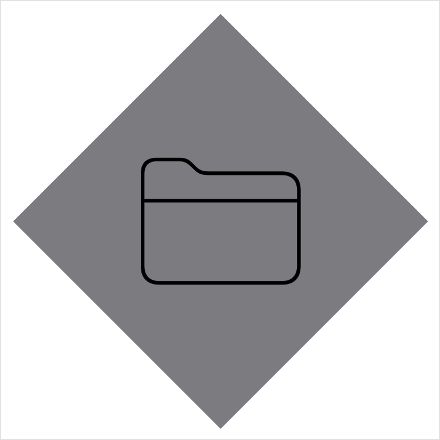

> Navigation: [Technologies](../../technologies.md) · [SwiftUI](../../swiftui.md) · [View](../view.md)

# background(_:alignment:)

<sub>Instance Method</sub>

Layers the given view behind this view.

> [!warning] Deprecated
> Use [background(alignment:content:)](<background(alignment_content_).md>) instead.

<sub>iOS, iPadOS, Mac Catalyst, macOS, tvOS, visionOS, watchOS</sub>

```swift
nonisolated func background<Background>(_ background: Background, alignment: Alignment = .center) -> some View where Background : View

```

## Parameters

- `background` — The view to draw behind this view.

- `alignment` — The alignment with a default value of [center](../alignment/center.md) that you use to position the background view.

## Discussion

Use `background(_:alignment:)` when you need to place one view behind another, with the background view optionally aligned with a specified edge of the frontmost view.

The example below creates two views: the `Frontmost` view, and the `DiamondBackground` view. The `Frontmost` view uses the `DiamondBackground` view for the background of the image element inside the `Frontmost` view’s [VStack](../vstack.md).

```swift
struct DiamondBackground: View {
    var body: some View {
        VStack {
            Rectangle()
                .fill(Color.gray)
                .frame(width: 250, height: 250, alignment: .center)
                .rotationEffect(.degrees(45.0))
        }
    }
}

struct Frontmost: View {
    var body: some View {
        VStack {
            Image(systemName: "folder")
                .font(.system(size: 128, weight: .ultraLight))
                .background(DiamondBackground())
        }
    }
}
```



## See Also

### Appearance modifiers

- [colorScheme(_:)](<colorscheme(__).md>) — Sets this view’s color scheme. _(deprecated)_
- [listRowPlatterColor(_:)](<listrowplattercolor(__).md>) — Sets the color that the system applies to the row background when this view is placed in a list. _(deprecated)_
- [overlay(_:alignment:)](<overlay(__alignment_).md>) — Layers a secondary view in front of this view. _(deprecated)_
- [foregroundColor(_:)](<foregroundcolor(__).md>) — Sets the color of the foreground elements displayed by this view. _(deprecated)_
- [complicationForeground()](<complicationforeground().md>) — Promotes this view to the foreground in a complication. _(deprecated)_
