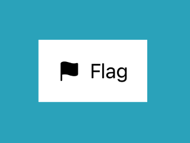

> Navigation: [Technologies](../../technologies.md) · [SwiftUI](../../swiftui.md) · [View](../view.md)

# background(ignoresSafeAreaEdges:)

<sub>Instance Method</sub>

Sets the view’s background to the default background style.

<sub>iOS, iPadOS, Mac Catalyst, macOS, tvOS, visionOS, watchOS</sub>

```swift
nonisolated func background(ignoresSafeAreaEdges edges: Edge.Set = .all) -> some View

```

## Parameters

- `edges` — The set of edges for which to ignore safe area insets when adding the background. The default value is [all](../edge/set/all.md). Specify an empty set to respect safe area insets on all edges.

## Return Value

A view with the [background](../shapestyle/background.md) shape style drawn behind it.

## Discussion

This modifier behaves like [background(_:ignoresSafeAreaEdges:)](<background(__ignoressafeareaedges_).md>), except that it always uses the [background](../shapestyle/background.md) shape style. For example, you can add a background to a [Label](../label.md):

```swift
ZStack {
    Color.teal
    Label("Flag", systemImage: "flag.fill")
        .padding()
        .background()
}
```

Without the background modifier, the teal color behind the label shows through the label. With the modifier, the label’s text and icon appear backed by a region filled with a color that’s appropriate for light or dark appearance:



If you want to specify a [View](../view.md) or a stack of views as the background, use [background(alignment:content:)](<background(alignment_content_).md>) instead. To specify a [Shape](../shape.md) or [InsettableShape](../insettableshape.md), use [background(_:in:fillStyle:)](<background(__in_fillstyle_).md>). To configure the background of a presentation, like a sheet, use [presentationBackground(_:)](<presentationbackground(__).md>).

## See Also

### Layering views

- [Adding a background to your view](../adding-a-background-to-your-view.md) — Compose a background behind your view and extend it beyond the safe area insets.
- [ZStack](../zstack.md) — A view that overlays its subviews, aligning them in both axes.
- [zIndex(_:)](<zindex(__).md>) — Controls the display order of overlapping views.
- [background(alignment:content:)](<background(alignment_content_).md>) — Layers the views that you specify behind this view.
- [background(_:ignoresSafeAreaEdges:)](<background(__ignoressafeareaedges_).md>) — Sets the view’s background to a style.
- [background(_:in:fillStyle:)](<background(__in_fillstyle_).md>) — Sets the view’s background to an insettable shape filled with a style.
- [background(in:fillStyle:)](<background(in_fillstyle_).md>) — Sets the view’s background to an insettable shape filled with the default background style.
- [overlay(alignment:content:)](<overlay(alignment_content_).md>) — Layers the views that you specify in front of this view.
- [overlay(_:ignoresSafeAreaEdges:)](<overlay(__ignoressafeareaedges_).md>) — Layers the specified style in front of this view.
- [overlay(_:in:fillStyle:)](<overlay(__in_fillstyle_).md>) — Layers a shape that you specify in front of this view.
- [backgroundMaterial](../environmentvalues/backgroundmaterial.md) — The material underneath the current view.
- [containerBackground(_:for:)](<containerbackground(__for_).md>) — Sets the container background of the enclosing container using a view.
- [containerBackground(for:alignment:content:)](<containerbackground(for_alignment_content_).md>) — Sets the container background of the enclosing container using a view.
- [ContainerBackgroundPlacement](../containerbackgroundplacement.md) — The placement of a container background.
