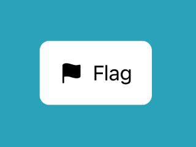

> Navigation: [Technologies](../../technologies.md) · [SwiftUI](../../swiftui.md) · [View](../view.md)

# background(in:fillStyle:)

<sub>Instance Method</sub>

Sets the view’s background to an insettable shape filled with the default background style.

<sub>iOS, iPadOS, Mac Catalyst, macOS, tvOS, visionOS, watchOS</sub>

```swift
nonisolated func background<S>(in shape: S, fillStyle: FillStyle = FillStyle()) -> some View where S : InsettableShape

```

## Parameters

- `shape` — An instance of a type that conforms to [InsettableShape](../insettableshape.md) that SwiftUI draws behind the view using the [background](../shapestyle/background.md) shape style.

- `fillStyle` — The [FillStyle](../fillstyle.md) to use when drawing the shape. The default style uses the nonzero winding number rule and antialiasing.

## Return Value

A view with the specified insettable shape drawn behind it.

## Discussion

This modifier behaves like [background(_:in:fillStyle:)](<background(__in_fillstyle_).md>), except that it always uses the [background](../shapestyle/background.md) shape style to fill the specified insettable shape. For example, you can use a [RoundedRectangle](../roundedrectangle.md) as a background on a [Label](../label.md):

```swift
ZStack {
    Color.teal
    Label("Flag", systemImage: "flag.fill")
        .padding()
        .background(in: RoundedRectangle(cornerRadius: 8))
}
```

Without the background modifier, the fill color shows through the label. With the modifier, the label’s text and icon appear backed by a shape filled with a color that’s appropriate for light or dark appearance:



To create a background with other [View](../view.md) types — or with a stack of views — use [background(alignment:content:)](<background(alignment_content_).md>) instead. To add a [ShapeStyle](../shapestyle.md) as a background, use [background(_:ignoresSafeAreaEdges:)](<background(__ignoressafeareaedges_).md>).

## See Also

### Layering views

- [Adding a background to your view](../adding-a-background-to-your-view.md) — Compose a background behind your view and extend it beyond the safe area insets.
- [ZStack](../zstack.md) — A view that overlays its subviews, aligning them in both axes.
- [zIndex(_:)](<zindex(__).md>) — Controls the display order of overlapping views.
- [background(alignment:content:)](<background(alignment_content_).md>) — Layers the views that you specify behind this view.
- [background(_:ignoresSafeAreaEdges:)](<background(__ignoressafeareaedges_).md>) — Sets the view’s background to a style.
- [background(ignoresSafeAreaEdges:)](<background(ignoressafeareaedges_).md>) — Sets the view’s background to the default background style.
- [background(_:in:fillStyle:)](<background(__in_fillstyle_).md>) — Sets the view’s background to an insettable shape filled with a style.
- [overlay(alignment:content:)](<overlay(alignment_content_).md>) — Layers the views that you specify in front of this view.
- [overlay(_:ignoresSafeAreaEdges:)](<overlay(__ignoressafeareaedges_).md>) — Layers the specified style in front of this view.
- [overlay(_:in:fillStyle:)](<overlay(__in_fillstyle_).md>) — Layers a shape that you specify in front of this view.
- [backgroundMaterial](../environmentvalues/backgroundmaterial.md) — The material underneath the current view.
- [containerBackground(_:for:)](<containerbackground(__for_).md>) — Sets the container background of the enclosing container using a view.
- [containerBackground(for:alignment:content:)](<containerbackground(for_alignment_content_).md>) — Sets the container background of the enclosing container using a view.
- [ContainerBackgroundPlacement](../containerbackgroundplacement.md) — The placement of a container background.
