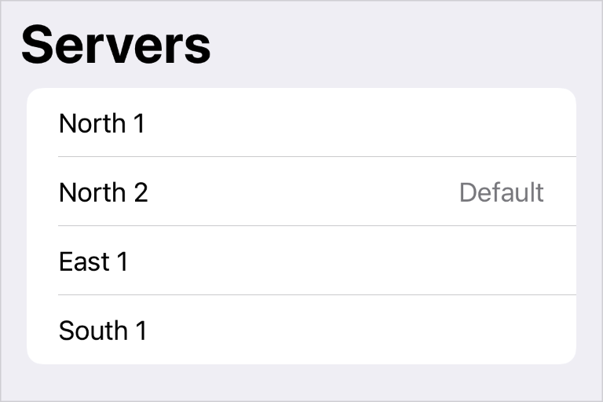

> Navigation: [Technologies](../../technologies.md) · [SwiftUI](../../swiftui.md) · [View](../view.md)

# badge(_:)

<sub>Instance Method</sub>

Generates a badge for the view from a localized string resource.

<sub>iOS, iPadOS, Mac Catalyst, macOS, visionOS</sub>

```swift
@export(implementation) nonisolated func badge(_ resource: LocalizedStringResource?) -> some View

```

## Parameters

- `resource` — An optional string resource to display as a badge. Set the value to `nil` to hide the badge.

## Discussion

Use a badge to convey optional, supplementary information about a view. Keep the contents of the badge as short as possible. Badges appear in list rows, tab bars, toolbar items, and menus.

This modifier creates a [Text](../text.md) view on your behalf. For more information about localizing strings, see [Text](../text.md). The following example shows a list with a “Default” badge on one of its rows.

```swift
NavigationView {
    List(servers) { server in
        Text(server.name)
            .badge(server.isDefault ? "Default" : nil)
    }
    .navigationTitle("Servers")
}
```



## See Also

### Displaying a badge on a list item

- [badgeProminence(_:)](<badgeprominence(__).md>) — Specifies the prominence of badges created by this view.
- [badgeProminence](../environmentvalues/badgeprominence.md) — The prominence to apply to badges associated with this environment.
- [BadgeProminence](../badgeprominence.md) — The visual prominence of a badge.
