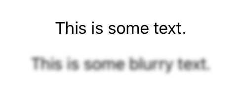

> Navigation: [Technologies](../../technologies.md) · [SwiftUI](../../swiftui.md) · [View](../view.md)

# blur(radius:opaque:)

<sub>Instance Method</sub>

Applies a Gaussian blur to this view.

<sub>iOS, iPadOS, Mac Catalyst, macOS, tvOS, visionOS, watchOS</sub>

```swift
nonisolated func blur(radius: CGFloat, opaque: Bool = false) -> some View

```

## Parameters

- `radius` — The radial size of the blur. A blur is more diffuse when its radius is large.

- `opaque` — A Boolean value that indicates whether the blur renderer permits transparency in the blur output. Set to `true` to create an opaque blur, or set to `false` to permit transparency.

## Discussion

Use `blur(radius:opaque:)` to apply a gaussian blur effect to the rendering of this view.

The example below shows two [Text](../text.md) views, the first with no blur effects, the second with `blur(radius:opaque:)` applied with the `radius` set to `2`. The larger the radius, the more diffuse the effect.

```swift
struct Blur: View {
    var body: some View {
        VStack {
            Text("This is some text.")
                .padding()
            Text("This is some blurry text.")
                .blur(radius: 2.0)
        }
    }
}
```



## See Also

### Applying blur and shadows

- [shadow(color:radius:x:y:)](<shadow(color_radius_x_y_).md>) — Adds a shadow to this view.
- [ColorMatrix](../colormatrix.md) — A matrix to use in an RGBA color transformation.
