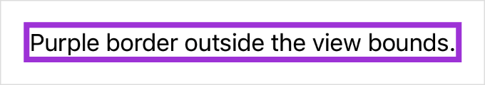

> Navigation: [Technologies](../../technologies.md) · [SwiftUI](../../swiftui.md) · [View](../view.md)

# border(_:width:)

<sub>Instance Method</sub>

Adds a border to this view with the specified style and width.

<sub>iOS, iPadOS, Mac Catalyst, macOS, tvOS, visionOS, watchOS</sub>

```swift
nonisolated func border<S>(_ content: S, width: CGFloat = 1) -> some View where S : ShapeStyle

```

## Parameters

- `content` — A value that conforms to the [ShapeStyle](../shapestyle.md) protocol, like a [Color](../color.md) or [HierarchicalShapeStyle](../hierarchicalshapestyle.md), that SwiftUI uses to fill the border.

- `width` — The thickness of the border. The default is 1 pixel.

## Return Value

A view that adds a border with the specified style and width to this view.

## Discussion

Use this modifier to draw a border of a specified width around the view’s frame. By default, the border appears inside the bounds of this view. For example, you can add a four-point wide border covers the text:

```swift
Text("Purple border inside the view bounds.")
    .border(Color.purple, width: 4)
```


To place a border around the outside of this view, apply padding of the same width before adding the border:

```swift
Text("Purple border outside the view bounds.")
    .padding(4)
    .border(Color.purple, width: 4)
```



## See Also

### Styling content

- [foregroundStyle(_:)](<foregroundstyle(__).md>) — Sets a view’s foreground elements to use a given style.
- [foregroundStyle(_:_:)](<foregroundstyle(____).md>) — Sets the primary and secondary levels of the foreground style in the child view.
- [foregroundStyle(_:_:_:)](<foregroundstyle(______).md>) — Sets the primary, secondary, and tertiary levels of the foreground style.
- [backgroundStyle(_:)](<backgroundstyle(__).md>) — Sets the specified style to render backgrounds within the view.
- [backgroundStyle](../environmentvalues/backgroundstyle.md) — An optional style that overrides the default system background style when set.
- [ShapeStyle](../shapestyle.md) — A color or pattern to use when rendering a shape.
- [AnyShapeStyle](../anyshapestyle.md) — A type-erased ShapeStyle value.
- [Gradient](../gradient.md) — A color gradient represented as an array of color stops, each having a parametric location value.
- [MeshGradient](../meshgradient.md) — A two-dimensional gradient defined by a 2D grid of positioned colors.
- [AnyGradient](../anygradient.md) — A color gradient.
- [ShadowStyle](../shadowstyle.md) — A style to use when rendering shadows.
- [Glass](../glass.md) — A structure that defines the configuration of the Liquid Glass material.
