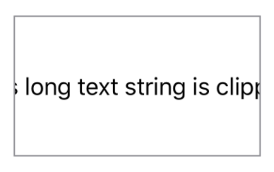

> Navigation: [Technologies](../../technologies.md) · [SwiftUI](../../swiftui.md) · [View](../view.md)

# clipped(antialiased:)

<sub>Instance Method</sub>

Clips this view to its bounding rectangular frame.

<sub>iOS, iPadOS, Mac Catalyst, macOS, tvOS, visionOS, watchOS</sub>

```swift
nonisolated func clipped(antialiased: Bool = false) -> some View

```

## Parameters

- `antialiased` — A Boolean value that indicates whether the rendering system applies smoothing to the edges of the clipping rectangle.

## Return Value

A view that clips this view to its bounding frame.

## Discussion

Use the `clipped(antialiased:)` modifier to hide any content that extends beyond the layout bounds of the shape.

By default, a view’s bounding frame is used only for layout, so any content that extends beyond the edges of the frame is still visible.

```swift
Text("This long text string is clipped")
    .fixedSize()
    .frame(width: 175, height: 100)
    .clipped()
    .border(Color.gray)
```



## See Also

### Masking and clipping

- [mask(alignment:_:)](<mask(alignment___).md>) — Masks this view using the alpha channel of the given view.
- [clipShape(_:style:)](<clipshape(__style_).md>) — Sets a clipping shape for this view.
