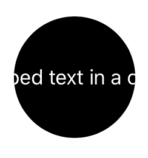

> Navigation: [Technologies](../../technologies.md) · [SwiftUI](../../swiftui.md) · [View](../view.md)

# clipShape(_:style:)

<sub>Instance Method</sub>

Sets a clipping shape for this view.

<sub>iOS, iPadOS, Mac Catalyst, macOS, tvOS, visionOS, watchOS</sub>

```swift
nonisolated func clipShape<S>(_ shape: S, style: FillStyle = FillStyle()) -> some View where S : Shape

```

## Parameters

- `shape` — The clipping shape to use for this view. The `shape` fills the view’s frame, while maintaining its aspect ratio.

- `style` — The fill style to use when rasterizing `shape`.

## Return Value

A view that clips this view to `shape`, using `style` to define the shape’s rasterization.

## Discussion

Use `clipShape(_:style:)` to clip the view to the provided shape. By applying a clipping shape to a view, you preserve the parts of the view covered by the shape, while eliminating other parts of the view. The clipping shape itself isn’t visible.

For example, this code applies a circular clipping shape to a `Text` view:

```swift
Text("Clipped text in a circle")
    .frame(width: 175, height: 100)
    .foregroundColor(Color.white)
    .background(Color.black)
    .clipShape(Circle())
```

The resulting view shows only the portion of the text that lies within the bounds of the circle.



## See Also

### Masking and clipping

- [mask(alignment:_:)](<mask(alignment___).md>) — Masks this view using the alpha channel of the given view.
- [clipped(antialiased:)](<clipped(antialiased_).md>) — Clips this view to its bounding rectangular frame.
