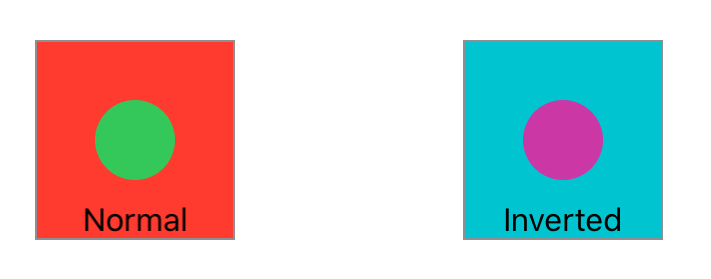

> Navigation: [Technologies](../../technologies.md) · [SwiftUI](../../swiftui.md) · [View](../view.md)

# colorInvert()

<sub>Instance Method</sub>

Inverts the colors in this view.

<sub>iOS, iPadOS, Mac Catalyst, macOS, tvOS, visionOS, watchOS</sub>

```swift
nonisolated func colorInvert() -> some View

```

## Return Value

A view that inverts its colors.

## Discussion

The `colorInvert()` modifier inverts all of the colors in a view so that each color displays as its complementary color. For example, blue converts to yellow, and white converts to black.

In the example below, two red squares each have an interior green circle. The inverted square shows the effect of the square’s colors: complimentary colors for red and green — teal and purple.

```swift
struct InnerCircleView: View {
    var body: some View {
        Circle()
            .fill(Color.green)
            .frame(width: 40, height: 40, alignment: .center)
    }
}

struct ColorInvert: View {
    var body: some View {
        HStack {
            Color.red.frame(width: 100, height: 100, alignment: .center)
                .overlay(InnerCircleView(), alignment: .center)
                .overlay(Text("Normal")
                             .font(.callout),
                         alignment: .bottom)
                .border(Color.gray)

            Spacer()

            Color.red.frame(width: 100, height: 100, alignment: .center)
                .overlay(InnerCircleView(), alignment: .center)
                .colorInvert()
                .overlay(Text("Inverted")
                             .font(.callout),
                         alignment: .bottom)
                .border(Color.gray)
        }
        .padding(50)
    }
}
```



## See Also

### Transforming colors

- [brightness(_:)](<brightness(__).md>) — Brightens this view by the specified amount.
- [contrast(_:)](<contrast(__).md>) — Sets the contrast and separation between similar colors in this view.
- [colorMultiply(_:)](<colormultiply(__).md>) — Adds a color multiplication effect to this view.
- [saturation(_:)](<saturation(__).md>) — Adjusts the color saturation of this view.
- [grayscale(_:)](<grayscale(__).md>) — Adds a grayscale effect to this view.
- [hueRotation(_:)](<huerotation(__).md>) — Applies a hue rotation effect to this view.
- [luminanceToAlpha()](<luminancetoalpha().md>) — Adds a luminance to alpha effect to this view.
- [materialActiveAppearance(_:)](<materialactiveappearance(__).md>) — Sets an explicit active appearance for materials in this view.
- [materialActiveAppearance](../environmentvalues/materialactiveappearance.md) — The behavior materials should use for their active state, defaulting to `automatic`.
- [MaterialActiveAppearance](../materialactiveappearance.md) — The behavior for how materials appear active and inactive.
