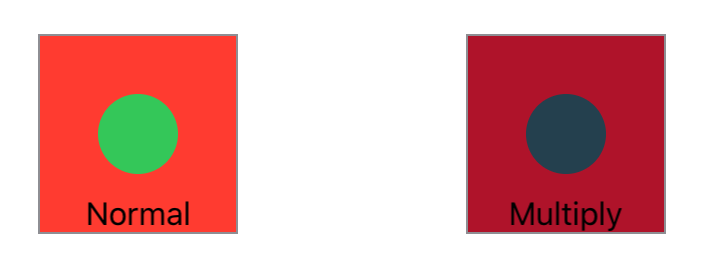

> Navigation: [Technologies](../../technologies.md) · [SwiftUI](../../swiftui.md) · [View](../view.md)

# colorMultiply(_:)

<sub>Instance Method</sub>

Adds a color multiplication effect to this view.

<sub>iOS, iPadOS, Mac Catalyst, macOS, tvOS, visionOS, watchOS</sub>

```swift
nonisolated func colorMultiply(_ color: Color) -> some View

```

## Parameters

- `color` — The color to bias this view toward.

## Return Value

A view with a color multiplication effect.

## Discussion

The following example shows two versions of the same image side by side; at left is the original, and at right is a duplicate with the `colorMultiply(_:)` modifier applied with [purple](../shapestyle/purple.md).

```swift
struct InnerCircleView: View {
    var body: some View {
        Circle()
            .fill(Color.green)
            .frame(width: 40, height: 40, alignment: .center)
    }
}

struct ColorMultiply: View {
    var body: some View {
        HStack {
            Color.red.frame(width: 100, height: 100, alignment: .center)
                .overlay(InnerCircleView(), alignment: .center)
                .overlay(Text("Normal")
                             .font(.callout),
                         alignment: .bottom)
                .border(Color.gray)

            Spacer()

            Color.red.frame(width: 100, height: 100, alignment: .center)
                .overlay(InnerCircleView(), alignment: .center)
                .colorMultiply(Color.purple)
                .overlay(Text("Multiply")
                            .font(.callout),
                         alignment: .bottom)
                .border(Color.gray)
        }
        .padding(50)
    }
}
```



## See Also

### Transforming colors

- [brightness(_:)](<brightness(__).md>) — Brightens this view by the specified amount.
- [contrast(_:)](<contrast(__).md>) — Sets the contrast and separation between similar colors in this view.
- [colorInvert()](<colorinvert().md>) — Inverts the colors in this view.
- [saturation(_:)](<saturation(__).md>) — Adjusts the color saturation of this view.
- [grayscale(_:)](<grayscale(__).md>) — Adds a grayscale effect to this view.
- [hueRotation(_:)](<huerotation(__).md>) — Applies a hue rotation effect to this view.
- [luminanceToAlpha()](<luminancetoalpha().md>) — Adds a luminance to alpha effect to this view.
- [materialActiveAppearance(_:)](<materialactiveappearance(__).md>) — Sets an explicit active appearance for materials in this view.
- [materialActiveAppearance](../environmentvalues/materialactiveappearance.md) — The behavior materials should use for their active state, defaulting to `automatic`.
- [MaterialActiveAppearance](../materialactiveappearance.md) — The behavior for how materials appear active and inactive.
