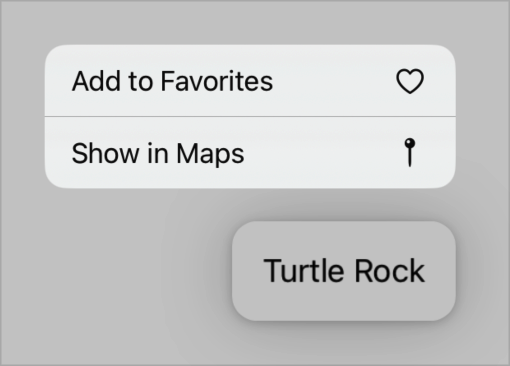

> Navigation: [Technologies](../../technologies.md) · [SwiftUI](../../swiftui.md) · [View](../view.md)

# contextMenu(menuItems:)

<sub>Instance Method</sub>

Adds a context menu to a view.

<sub>iOS, iPadOS, Mac Catalyst, macOS, tvOS, visionOS, watchOS</sub>

```swift
nonisolated func contextMenu<MenuItems>(@ContentBuilder menuItems: () -> MenuItems) -> some View where MenuItems : View

```

## Parameters

- `menuItems` — A closure that produces the menu’s contents. You can deactivate the context menu by returning nothing from the closure.

## Return Value

A view that can display a context menu.

## Discussion

Use this modifier to add a context menu to a view in your app’s user interface. Compose the menu by returning controls like [Button](../button.md), [Toggle](../toggle.md), and [Picker](../picker.md) from the `menuItems` closure. You can also use [Menu](../menu.md) to define submenus or [Section](../section.md) to group items.

The following example creates a [Text](../text.md) view that has a context menu with two buttons:

```swift
Text("Turtle Rock")
    .padding()
    .contextMenu {
        Button {
            // Add this item to a list of favorites.
        } label: {
            Label("Add to Favorites", systemImage: "heart")
        }
        Button {
            // Open Maps and center it on this item.
        } label: {
            Label("Show in Maps", systemImage: "mappin")
        }
    }
```

When someone activates the context menu with an action like touch and hold in iOS or iPadOS, the system displays the menu next to the content:



The system dismisses the menu if someone makes a selection, or taps or clicks outside the menu.

To customize the default preview, apply a [contentShape(_:_:eoFill:)](<contentshape(____eofill_).md>) with a [contextMenuPreview](../contentshapekinds/contextmenupreview.md) kind. For example, you can change the preview’s corner radius or use a nested view as the preview.

> [!note] Note
> This view modifier produces a context menu on macOS, but that platform doesn’t display a preview.

If you want to show a different preview, you can use [contextMenu(menuItems:preview:)](<contextmenu(menuitems_preview_).md>). To add a context menu to a container that supports selection, like a [List](../list.md) or a [Table](../table.md), and to distinguish between menu activation on a selection and activation in an empty area of the container, use [contextMenu(forSelectionType:menu:primaryAction:)](<contextmenu(forselectiontype_menu_primaryaction_).md>).

## See Also

### Creating context menus

- [contextMenu(menuItems:preview:)](<contextmenu(menuitems_preview_).md>) — Adds a context menu with a custom preview to a view.
- [contextMenu(forSelectionType:menu:primaryAction:)](<contextmenu(forselectiontype_menu_primaryaction_).md>) — Adds an item-based context menu to a view.
