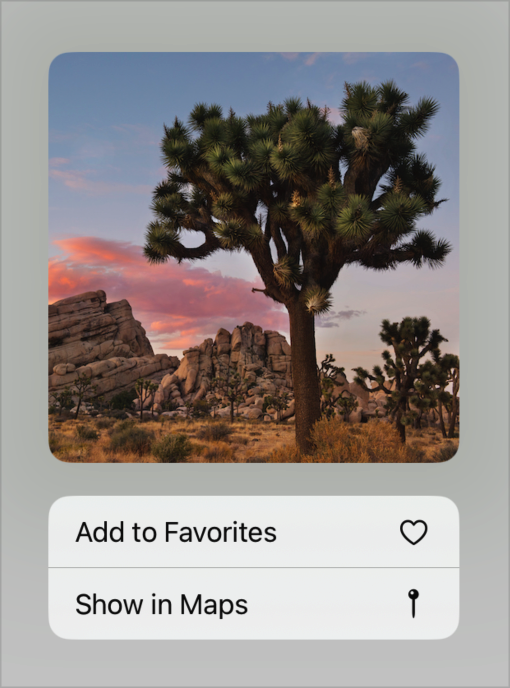

> Navigation: [Technologies](../../technologies.md) · [SwiftUI](../../swiftui.md) · [View](../view.md)

# contextMenu(menuItems:preview:)

<sub>Instance Method</sub>

Adds a context menu with a custom preview to a view.

<sub>iOS, iPadOS, Mac Catalyst, macOS, tvOS, visionOS</sub>

```swift
nonisolated func contextMenu<M, P>(@ContentBuilder menuItems: () -> M, @ContentBuilder preview: () -> P) -> some View where M : View, P : View

```

## Parameters

- `menuItems` — A closure that produces the menu’s contents. You can deactivate the context menu by returning nothing from the closure.

- `preview` — A view that the system displays along with the menu.

## Return Value

A view that can display a context menu with a preview.

## Discussion

When you use this modifer to add a context menu to a view in your app’s user interface, the system displays the custom preview beside the menu. Compose the menu by returning controls like [Button](../button.md), [Toggle](../toggle.md), and [Picker](../picker.md) from the `menuItems` closure. You can also use [Menu](../menu.md) to define submenus or [Section](../section.md) to group items.

Define the custom preview by returning a view from the `preview` closure. The system sizes the preview to match the size of its content. For example, you can add a two button context menu to a [Text](../text.md) view, and use an [Image](../image.md) as the preview:

```swift
Text("Turtle Rock")
    .padding()
    .contextMenu {
        Button {
            // Add this item to a list of favorites.
        } label: {
            Label("Add to Favorites", systemImage: "heart")
        }
        Button {
            // Open Maps and center it on this item.
        } label: {
            Label("Show in Maps", systemImage: "mappin")
        }
    } preview: {
        Image("turtlerock") // Loads the image from an asset catalog.
    }
```

When someone activates the context menu with an action like touch and hold in iOS or iPadOS, the system displays the image and the menu:



To customize the lift preview, shown while the system transitions to show your custom `preview`, apply a [contentShape(_:_:eoFill:)](<contentshape(____eofill_).md>) with a [contextMenuPreview](../contentshapekinds/contextmenupreview.md) kind. For example, you can change the lift preview’s corner radius or use a nested view as the lift preview.

> [!note] Note
> This view modifier produces a context menu on macOS, but that platform doesn’t display the preview.

If you don’t need a preview, use [contextMenu(menuItems:)](<contextmenu(menuitems_).md>) instead. If you want to add a context menu to a container that supports selection, like a [List](../list.md) or a [Table](../table.md), and you want to distinguish between menu activation on a selection and activation in an empty area of the container, use [contextMenu(forSelectionType:menu:primaryAction:)](<contextmenu(forselectiontype_menu_primaryaction_).md>).

## See Also

### Creating context menus

- [contextMenu(menuItems:)](<contextmenu(menuitems_).md>) — Adds a context menu to a view.
- [contextMenu(forSelectionType:menu:primaryAction:)](<contextmenu(forselectiontype_menu_primaryaction_).md>) — Adds an item-based context menu to a view.
