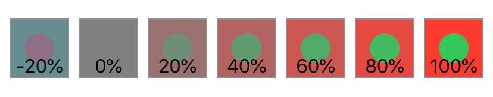

> Navigation: [Technologies](../../technologies.md) · [SwiftUI](../../swiftui.md) · [View](../view.md)

# contrast(_:)

<sub>Instance Method</sub>

Sets the contrast and separation between similar colors in this view.

<sub>iOS, iPadOS, Mac Catalyst, macOS, tvOS, visionOS, watchOS</sub>

```swift
nonisolated func contrast(_ amount: Double) -> some View

```

## Parameters

- `amount` — The intensity of color contrast to apply. negative values invert colors in addition to applying contrast.

## Return Value

A view that applies color contrast to this view.

## Discussion

Apply contrast to a view to increase or decrease the separation between similar colors in the view.

In the example below, the `contrast(_:)` modifier is applied to a set of red squares each containing a contrasting green inner circle. At each step in the loop, the `contrast(_:)` modifier changes the contrast of the circle/square view in 20% increments. This ranges from -20% contrast (yielding inverted colors — turning the red square to pale-green and the green circle to mauve), to neutral-gray at 0%, to 100% contrast (bright-red square / bright-green circle). Applying negative contrast values, as shown in the -20% square, will apply contrast in addition to inverting colors.

```swift
struct CircleView: View {
    var body: some View {
        Circle()
            .fill(Color.green)
            .frame(width: 25, height: 25, alignment: .center)
    }
}

struct Contrast: View {
    var body: some View {
        HStack {
            ForEach(-1..<6) {
                Color.red.frame(width: 50, height: 50, alignment: .center)
                    .overlay(CircleView(), alignment: .center)
                    .contrast(Double($0) * 0.2)
                    .overlay(Text("\(Double($0) * 0.2 * 100, specifier: "%.0f")%")
                                 .font(.callout),
                             alignment: .bottom)
                    .border(Color.gray)
            }
        }
    }
}
```



## See Also

### Transforming colors

- [brightness(_:)](<brightness(__).md>) — Brightens this view by the specified amount.
- [colorInvert()](<colorinvert().md>) — Inverts the colors in this view.
- [colorMultiply(_:)](<colormultiply(__).md>) — Adds a color multiplication effect to this view.
- [saturation(_:)](<saturation(__).md>) — Adjusts the color saturation of this view.
- [grayscale(_:)](<grayscale(__).md>) — Adds a grayscale effect to this view.
- [hueRotation(_:)](<huerotation(__).md>) — Applies a hue rotation effect to this view.
- [luminanceToAlpha()](<luminancetoalpha().md>) — Adds a luminance to alpha effect to this view.
- [materialActiveAppearance(_:)](<materialactiveappearance(__).md>) — Sets an explicit active appearance for materials in this view.
- [materialActiveAppearance](../environmentvalues/materialactiveappearance.md) — The behavior materials should use for their active state, defaulting to `automatic`.
- [MaterialActiveAppearance](../materialactiveappearance.md) — The behavior for how materials appear active and inactive.
