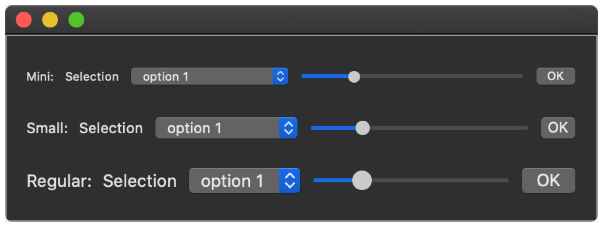

> Navigation: [Technologies](../../technologies.md) · [SwiftUI](../../swiftui.md) · [View](../view.md)

# controlSize(_:)

<sub>Instance Method</sub>

Sets the size for controls within this view.

<sub>iOS, iPadOS, Mac Catalyst, macOS, tvOS, visionOS, watchOS</sub>

```swift
nonisolated func controlSize(_ controlSize: ControlSize) -> some View

```

## Parameters

- `controlSize` — One of the control sizes specified in the [ControlSize](../controlsize.md) enumeration.

## Discussion

Use `controlSize(_:)` to override the system default size for controls in this view. In this example, a view displays several typical controls at `.mini`, `.small` and `.regular` sizes.

```swift
struct ControlSize: View {
    var body: some View {
        VStack {
            MyControls(label: "Mini")
                .controlSize(.mini)
            MyControls(label: "Small")
                .controlSize(.small)
            MyControls(label: "Regular")
                .controlSize(.regular)
        }
        .padding()
        .frame(width: 450)
        .border(Color.gray)
    }
}

struct MyControls: View {
    var label: String
    @State private var value = 3.0
    @State private var selected = 1
    var body: some View {
        HStack {
            Text(label + ":")
            Picker("Selection", selection: $selected) {
                Text("option 1").tag(1)
                Text("option 2").tag(2)
                Text("option 3").tag(3)
            }
            Slider(value: $value, in: 1...10)
            Button("OK") { }
        }
    }
}
```



## See Also

### Sizing controls

- [controlSize](../environmentvalues/controlsize.md) — The size to apply to controls within a view.
- [ControlSize](../controlsize.md) — The size classes, like regular or small, that you can apply to controls within a view.
