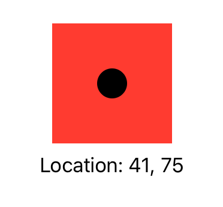

> Navigation: [Technologies](../../technologies.md) · [SwiftUI](../../swiftui.md) · [View](../view.md)

# coordinateSpace(name:)

<sub>Instance Method</sub>

Assigns a name to the view’s coordinate space, so other code can operate on dimensions like points and sizes relative to the named space.

> [!warning] Deprecated
> Use [coordinateSpace(_:)](<coordinatespace(__).md>) instead.

<sub>iOS, iPadOS, Mac Catalyst, macOS, tvOS, visionOS, watchOS</sub>

```swift
nonisolated func coordinateSpace<T>(name: T) -> some View where T : Hashable

```

## Parameters

- `name` — A name used to identify this coordinate space.

## Discussion

Use `coordinateSpace(name:)` to allow another function to find and operate on a view and operate on dimensions relative to that view.

The example below demonstrates how a nested view can find and operate on its enclosing view’s coordinate space:

```swift
struct ContentView: View {
    @State private var location = CGPoint.zero

    var body: some View {
        VStack {
            Color.red.frame(width: 100, height: 100)
                .overlay(circle)
            Text("Location: \(Int(location.x)), \(Int(location.y))")
        }
        .coordinateSpace(name: "stack")
    }

    var circle: some View {
        Circle()
            .frame(width: 25, height: 25)
            .gesture(drag)
            .padding(5)
    }

    var drag: some Gesture {
        DragGesture(coordinateSpace: .named("stack"))
            .onChanged { info in location = info.location }
    }
}
```

Here, the [VStack](../vstack.md) in the `ContentView` named “stack” is composed of a red frame with a custom [Circle](../circle.md) view [overlay(_:alignment:)](<overlay(__alignment_).md>) at its center.

The `circle` view has an attached [DragGesture](../draggesture.md) that targets the enclosing VStack’s coordinate space. As the gesture recognizer’s closure registers events inside `circle` it stores them in the shared `location` state variable and the [VStack](../vstack.md) displays the coordinates in a [Text](../text.md) view.



## See Also

### Layout modifiers

- [frame()](<frame().md>) — Positions this view within an invisible frame. _(deprecated)_
- [edgesIgnoringSafeArea(_:)](<edgesignoringsafearea(__).md>) — Changes the view’s proposed area to extend outside the screen’s safe areas. _(deprecated)_
