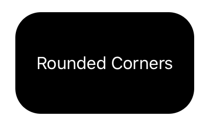

> Navigation: [Technologies](../../technologies.md) · [SwiftUI](../../swiftui.md) · [View](../view.md)

# cornerRadius(_:antialiased:)

<sub>Instance Method</sub>

Clips this view to its bounding frame, with the specified corner radius.

> [!warning] Deprecated
> Use [clipShape(_:style:)](<clipshape(__style_).md>) or [fill(style:)](<../shape/fill(style_).md>) instead.

<sub>iOS, iPadOS, Mac Catalyst, macOS, tvOS, visionOS, watchOS</sub>

```swift
nonisolated func cornerRadius(_ radius: CGFloat, antialiased: Bool = true) -> some View

```

## Parameters

- `radius` — A CGFloat value that specifies the corner radius to use when clipping the view to its bounding frame.

- `antialiased` — A Boolean value that indicates whether the rendering system applies smoothing to the edges of the clipping rectangle.

## Return Value

A view that clips this view to its bounding frame with the specified corner radius.

## Discussion

By default, a view’s bounding frame only affects its layout, so any content that extends beyond the edges of the frame remains visible. Use `cornerRadius(_:antialiased:)` to hide any content that extends beyond these edges while applying a corner radius.

The following code applies a corner radius of 25 to a text view:

```swift
Text("Rounded Corners")
    .frame(width: 175, height: 75)
    .foregroundColor(Color.white)
    .background(Color.black)
    .cornerRadius(25)
```



## See Also

### Graphics and rendering modifiers

- [accentColor(_:)](<accentcolor(__).md>) — Sets the accent color for this view and the views it contains. _(deprecated)_
- [mask(_:)](<mask(__).md>) — Masks this view using the alpha channel of the given view. _(deprecated)_
- [animation(_:)](<animation(__)-1hc0p.md>) — Applies the given animation to all animatable values within this view. _(deprecated)_
