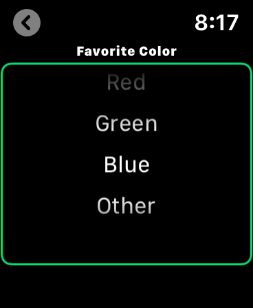

> Navigation: [Technologies](../../technologies.md) · [SwiftUI](../../swiftui.md) · [View](../view.md)

# defaultWheelPickerItemHeight(_:)

<sub>Instance Method</sub>

Sets the default wheel-style picker item height.

<sub>watchOS</sub>

```swift
nonisolated func defaultWheelPickerItemHeight(_ height: CGFloat) -> some View

```

## Parameters

- `height` — The height for the picker items.

## Discussion

Use `defaultWheelPickerItemHeight(_:)` when you need to change the default item height in a picker control. In this example, the view sets the default height for picker elements to 30 points.

```swift
struct DefaultWheelPickerItemHeight: View {
    @State private var selected = 1
    var body: some View {
        VStack(spacing: 20) {
            Picker(selection: $selected, label: Text("Favorite Color")) {
                Text("Red").tag(1)
                Text("Green").tag(2)
                Text("Blue").tag(3)
                Text("Other").tag(4)
            }
        }
        .defaultWheelPickerItemHeight(30)
    }
}
```



## See Also

### Choosing from a set of options

- [Picker](../picker.md) — A control for selecting from a set of mutually exclusive values.
- [pickerStyle(_:)](<pickerstyle(__).md>) — Sets the style for pickers within this view.
- [horizontalRadioGroupLayout()](<horizontalradiogrouplayout().md>) — Sets the style for radio group style pickers within this view to be horizontally positioned with the radio buttons inside the layout.
- [defaultWheelPickerItemHeight](../environmentvalues/defaultwheelpickeritemheight.md) — The default height of an item in a wheel-style picker, such as a date picker.
- [paletteSelectionEffect(_:)](<paletteselectioneffect(__).md>) — Specifies the selection effect to apply to a palette item.
- [PaletteSelectionEffect](../paletteselectioneffect.md) — The selection effect to apply to a palette item.
