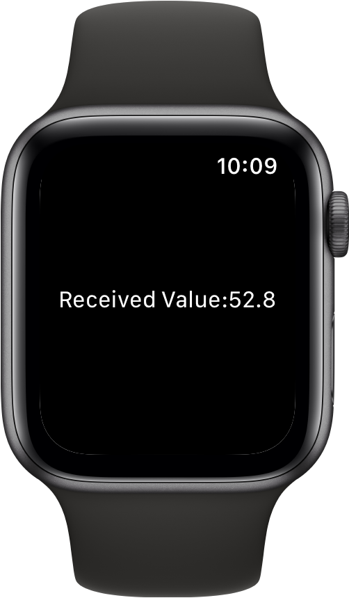

> Navigation: [Technologies](../../technologies.md) · [SwiftUI](../../swiftui.md) · [View](../view.md)

# digitalCrownRotation(_:)

<sub>Instance Method</sub>

Tracks Digital Crown rotations by updating the specified binding.

<sub>watchOS</sub>

```swift
nonisolated func digitalCrownRotation<V>(_ binding: Binding<V>) -> some View where V : BinaryFloatingPoint

```

## Parameters

- `binding` — A binding to a value that updates as the user rotates the Digital Crown. The implicit range is `(-infinity, +infinity)`.

## Discussion

Use this method to receive values on a binding you provide as the user turns the Digital Crown on Apple Watch. The example below receives changes to the binding value, starting at `0.0` and incrementing or decrementing depending on the direction that the user turns the Digital Crown:

```swift
struct DigitalCrown: View {
    @State private var crownValue = 0.0

    var body: some View {
        Text("Received Value:\(crownValue, specifier: "%.1f")")
            .focusable()
            .digitalCrownRotation($crownValue)
    }
}
```



## See Also

### Interacting with the Digital Crown

- [digitalCrownAccessory(_:)](<digitalcrownaccessory(__).md>) — Specifies the visibility of Digital Crown accessory Views on Apple Watch.
- [digitalCrownAccessory(content:)](<digitalcrownaccessory(content_).md>) — Places an accessory View next to the Digital Crown on Apple Watch.
- [digitalCrownRotation(_:from:through:sensitivity:isContinuous:isHapticFeedbackEnabled:onChange:onIdle:)](<digitalcrownrotation(__from_through_sensitivity_iscontinuous_ishapticfeedbackenabled_onchange_onidle_).md>) — Tracks Digital Crown rotations by updating the specified binding.
- [digitalCrownRotation(_:onChange:onIdle:)](<digitalcrownrotation(__onchange_onidle_).md>) — Tracks Digital Crown rotations by updating the specified binding.
- [digitalCrownRotation(detent:from:through:by:sensitivity:isContinuous:isHapticFeedbackEnabled:onChange:onIdle:)](<digitalcrownrotation(detent_from_through_by_sensitivity_iscontinuous_ishapticfeedbackenabled_onchange_onidle_).md>) — Tracks Digital Crown rotations by updating the specified binding.
- [digitalCrownRotation(_:from:through:by:sensitivity:isContinuous:isHapticFeedbackEnabled:)](<digitalcrownrotation(__from_through_by_sensitivity_iscontinuous_ishapticfeedbackenabled_).md>) — Tracks Digital Crown rotations by updating the specified binding.
- [DigitalCrownEvent](../digitalcrownevent.md) — An event emitted when the user rotates the Digital Crown.
- [DigitalCrownRotationalSensitivity](../digitalcrownrotationalsensitivity.md) — The amount of Digital Crown rotation needed to move between two integer numbers.
