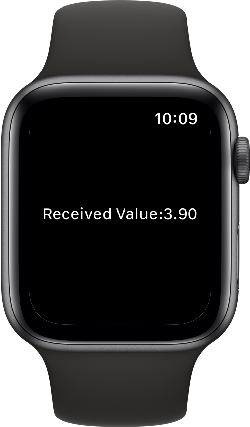

> Navigation: [Technologies](../../technologies.md) · [SwiftUI](../../swiftui.md) · [View](../view.md)

# digitalCrownRotation(_:from:through:by:sensitivity:isContinuous:isHapticFeedbackEnabled:)

<sub>Instance Method</sub>

Tracks Digital Crown rotations by updating the specified binding.

<sub>watchOS</sub>

```swift
nonisolated func digitalCrownRotation<V>(_ binding: Binding<V>, from minValue: V, through maxValue: V, by stride: V.Stride? = nil, sensitivity: DigitalCrownRotationalSensitivity = .high, isContinuous: Bool = false, isHapticFeedbackEnabled: Bool = true) -> some View where V : BinaryFloatingPoint, V.Stride : BinaryFloatingPoint

```

## Parameters

- `binding` — A binding to a value that updates when the user rotates the  Digital Crown.

- `minValue` — Lower end of the range reported.

- `maxValue` — Upper end of the range reported.

- `stride` — The value settles on multiples of `stride`.

- `sensitivity` — How much the user needs to rotate the  Digital Crown to move between two integer numbers.

- `isContinuous` — Controls if the value reported stops at `minValue` and `maxValue`, or if it should wrap around. Default is `false`.

- `isHapticFeedbackEnabled` — Controls the generation of haptic feedback when turning the Digital Crown. Default is `true`.

## Discussion

Use this method to receive values on a binding you provides as the user turns the Digital Crown on Apple Watch. The example below receives changes to the binding value, starting at the `minValue` of  `0.0`  up to the `maxValue` of `10.0` in steps of `0.1` incrementing or decrementing depending on the direction that the user turns the Digital Crown, rolling over if the user exceeds the specified boundary values:

```swift
struct DigitalCrown: View {
    @State private var crownValue = 0.0
    @State private var minValue = 0.0
    @State private var maxValue = 10.0
    @State private var stepAmount = 0.1

    var body: some View {
        Text("Received Value:\(crownValue, specifier: "%.2f")")
            .focusable()
            .digitalCrownRotation($crownValue,
                                  from: minValue,
                                  through: maxValue,
                                  by: stepAmount,
                                  sensitivity: .low,
                                  isContinuous: true)
    }
}
```



## See Also

### Interacting with the Digital Crown

- [digitalCrownAccessory(_:)](<digitalcrownaccessory(__).md>) — Specifies the visibility of Digital Crown accessory Views on Apple Watch.
- [digitalCrownAccessory(content:)](<digitalcrownaccessory(content_).md>) — Places an accessory View next to the Digital Crown on Apple Watch.
- [digitalCrownRotation(_:from:through:sensitivity:isContinuous:isHapticFeedbackEnabled:onChange:onIdle:)](<digitalcrownrotation(__from_through_sensitivity_iscontinuous_ishapticfeedbackenabled_onchange_onidle_).md>) — Tracks Digital Crown rotations by updating the specified binding.
- [digitalCrownRotation(_:onChange:onIdle:)](<digitalcrownrotation(__onchange_onidle_).md>) — Tracks Digital Crown rotations by updating the specified binding.
- [digitalCrownRotation(detent:from:through:by:sensitivity:isContinuous:isHapticFeedbackEnabled:onChange:onIdle:)](<digitalcrownrotation(detent_from_through_by_sensitivity_iscontinuous_ishapticfeedbackenabled_onchange_onidle_).md>) — Tracks Digital Crown rotations by updating the specified binding.
- [digitalCrownRotation(_:)](<digitalcrownrotation(__).md>) — Tracks Digital Crown rotations by updating the specified binding.
- [DigitalCrownEvent](../digitalcrownevent.md) — An event emitted when the user rotates the Digital Crown.
- [DigitalCrownRotationalSensitivity](../digitalcrownrotationalsensitivity.md) — The amount of Digital Crown rotation needed to move between two integer numbers.
