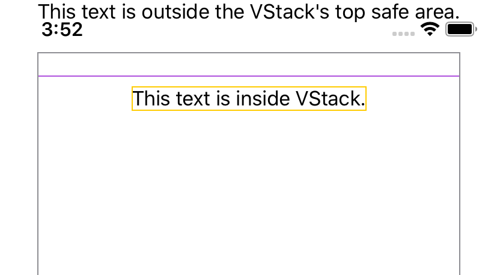

> Navigation: [Technologies](../../technologies.md) · [SwiftUI](../../swiftui.md) · [View](../view.md)

# edgesIgnoringSafeArea(_:)

<sub>Instance Method</sub>

Changes the view’s proposed area to extend outside the screen’s safe areas.

> [!warning] Deprecated
> Use [ignoresSafeArea(_:edges:)](<ignoressafearea(__edges_).md>) instead.

<sub>iOS, iPadOS, Mac Catalyst, macOS, tvOS, visionOS, watchOS</sub>

```swift
nonisolated func edgesIgnoringSafeArea(_ edges: Edge.Set) -> some View

```

## Parameters

- `edges` — The set of the edges in which to expand the size requested for this view.

## Return Value

A view that may extend outside of the screen’s safe area on the edges specified by `edges`.

## Discussion

Use `edgesIgnoringSafeArea(_:)` to change the area proposed for this view so that — were the proposal accepted — this view could extend outside the safe area to the bounds of the screen for the specified edges.

For example, you can propose that a text view ignore the safe area’s top inset:

```swift
VStack {
    Text("This text is outside of the top safe area.")
        .edgesIgnoringSafeArea([.top])
        .border(Color.purple)
    Text("This text is inside VStack.")
        .border(Color.yellow)
}
.border(Color.gray)
```



Depending on the surrounding view hierarchy, SwiftUI may not honor an `edgesIgnoringSafeArea(_:)` request. This can happen, for example, if the view is inside a container that respects the screen’s safe area. In that case you may need to apply `edgesIgnoringSafeArea(_:)` to the container instead.

## See Also

### Layout modifiers

- [frame()](<frame().md>) — Positions this view within an invisible frame. _(deprecated)_
- [coordinateSpace(name:)](<coordinatespace(name_).md>) — Assigns a name to the view’s coordinate space, so other code can operate on dimensions like points and sizes relative to the named space. _(deprecated)_
