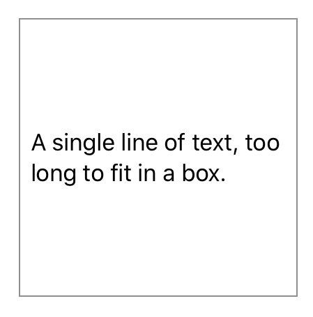
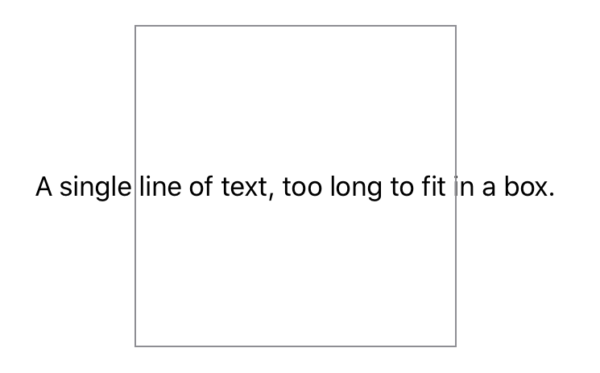

> Navigation: [Technologies](../../technologies.md) · [SwiftUI](../../swiftui.md) · [View](../view.md)

# fixedSize()

<sub>Instance Method</sub>

Fixes this view at its ideal size.

<sub>iOS, iPadOS, Mac Catalyst, macOS, tvOS, visionOS, watchOS</sub>

```swift
@export(implementation) nonisolated func fixedSize() -> some View

```

## Return Value

A view that fixes this view at its ideal size.

## Discussion

During the layout of the view hierarchy, each view proposes a size to each child view it contains. If the child view doesn’t need a fixed size it can accept and conform to the size offered by the parent.

For example, a [Text](../text.md) view placed in an explicitly sized frame wraps and truncates its string to remain within its parent’s bounds:

```swift
Text("A single line of text, too long to fit in a box.")
    .frame(width: 200, height: 200)
    .border(Color.gray)
```



The `fixedSize()` modifier can be used to create a view that maintains the _ideal size_ of its children both dimensions:

```swift
Text("A single line of text, too long to fit in a box.")
    .fixedSize()
    .frame(width: 200, height: 200)
    .border(Color.gray)
```

This can result in the view exceeding the parent’s bounds, which may or may not be the effect you want.



You can think of `fixedSize()` as the creation of a _counter proposal_ to the view size proposed to a view by its parent. The ideal size of a view, and the specific effects of `fixedSize()` depends on the particular view and how you have configured it.

To create a view that fixes the view’s size in either the horizontal or vertical dimensions, see [fixedSize(horizontal:vertical:)](<fixedsize(horizontal_vertical_).md>).

## See Also

### Influencing a view’s size

- [frame(width:height:alignment:)](<frame(width_height_alignment_).md>) — Positions this view within an invisible frame with the specified size.
- [frame(depth:alignment:)](<frame(depth_alignment_).md>) — Positions this view within an invisible frame with the specified depth.
- [frame(minWidth:idealWidth:maxWidth:minHeight:idealHeight:maxHeight:alignment:)](<frame(minwidth_idealwidth_maxwidth_minheight_idealheight_maxheight_alignment_).md>) — Positions this view within an invisible frame having the specified size constraints.
- [frame(minDepth:idealDepth:maxDepth:alignment:)](<frame(mindepth_idealdepth_maxdepth_alignment_).md>) — Positions this view within an invisible frame having the specified depth constraints.
- [containerRelativeFrame(_:alignment:)](<containerrelativeframe(__alignment_).md>) — Positions this view within an invisible frame with a size relative to the nearest container.
- [containerRelativeFrame(_:alignment:_:)](<containerrelativeframe(__alignment___).md>) — Positions this view within an invisible frame with a size relative to the nearest container.
- [containerRelativeFrame(_:count:span:spacing:alignment:)](<containerrelativeframe(__count_span_spacing_alignment_).md>) — Positions this view within an invisible frame with a size relative to the nearest container.
- [fixedSize(horizontal:vertical:)](<fixedsize(horizontal_vertical_).md>) — Fixes this view at its ideal size in the specified dimensions.
- [layoutPriority(_:)](<layoutpriority(__).md>) — Sets the priority by which a parent layout should apportion space to this child.
