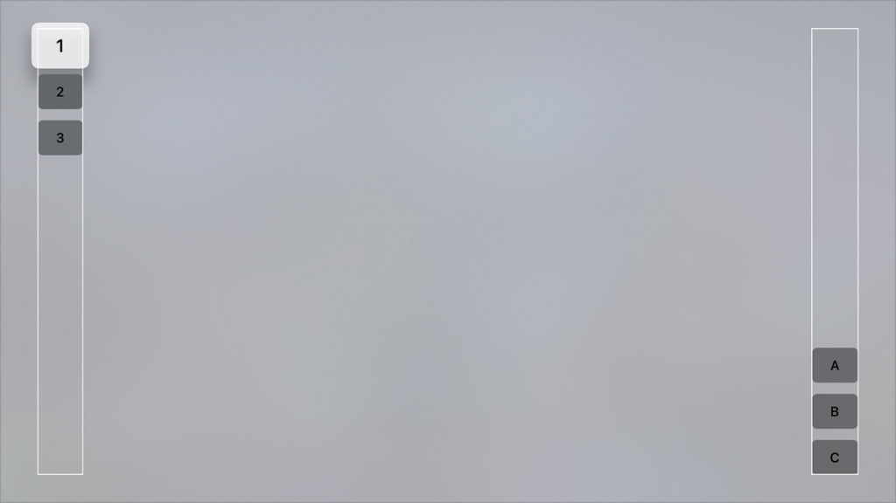

> Navigation: [Technologies](../../technologies.md) · [SwiftUI](../../swiftui.md) · [View](../view.md)

# focusSection()

<sub>Instance Method</sub>

Indicates that the view’s frame and cohort of focusable descendants should be used to guide focus movement.

<sub>macOS, tvOS</sub>

```swift
nonisolated func focusSection() -> some View

```

## Return Value

A view that can guide focus to its focusable descendants.

## Discussion

Use focus sections to customize SwiftUI’s behavior when the user moves focus between views.

The following tvOS example places three buttons (“1”, “2”, and “3”) at the upper left of the screen and three buttons (“A”, “B”, and “C”) at the bottom right. By default, swiping right on the Siri Remote on any of the buttons in the “1” - “3” group would do nothing, since the focus system finds no focusable views directly to their right. But by declaring the [VStack](../vstack.md) that encloses buttons “A” - “C” as a focus section, the [VStack](../vstack.md) can receive focus, and deliver that focus to its first focusable child (button “A”). The example puts a border on the [VStack](../vstack.md) to illustrate this spatial arrangement.

```swift
var body: some View {
    HStack {
        VStack {
            Button ("1") {}
            Button ("2") {}
            Button ("3") {}
            Spacer()
        }
        .border(Color.white, width: 2)

        Spacer()
        VStack {
            Spacer()
            Button ("A") {}
            Button ("B") {}
            Button ("C") {}
        }
        .border(Color.white, width: 2)
        .focusSection()
    }
}
```



Note that because the [VStack](../vstack.md) containing buttons “1” - “3” does not declare itself as a focus section, it is impossible to direct focus back to the left from buttons “A” - “C”. None of those buttons has a focusable view — in this case either a button or a [VStack](../vstack.md) with the `focusSection()` modifier — directly to its left.

Applying this modifier to a view affects focus behavior based on the style of movement:

- **Directional movement**: Navigating with Siri Remote gestures, arrow keys on a keyboard, or any other type of input that works in terms of cardinal directions (up, down, left, right) produces directional movement. When modified with `focusSection()`, the view’s frame becomes capable of accepting focus in order to direct it at its nearest focusable descendant in the direction of travel. In the earlier example, declaring the right-side [VStack](../vstack.md) as a focus section allowed it to receive right-directed focus from the buttons on the left.
- **Sequential movement**: Navigating with a Digital Crown, the Tab key on a keyboard, or any other type of input that works in terms of the next or previous item in a sequence, produces sequential movement. When you use the `focusSection()` modifier, SwiftUI deviates from its default layout-based sequence to visit each of the modified view’s focusable descendants before resuming the default sequence. Within the set of focusable descendants, SwiftUI continues to visit views in layout order (leading-to-trailing, top-to-bottom).

`focusSection()` does not affect the focusability of the modified view. If the modified view has no focusable descendants, then the modifier does nothing.

## See Also

### Setting focus scope

- [focusScope(_:)](<focusscope(__).md>) — Creates a focus scope that SwiftUI uses to limit default focus preferences.
