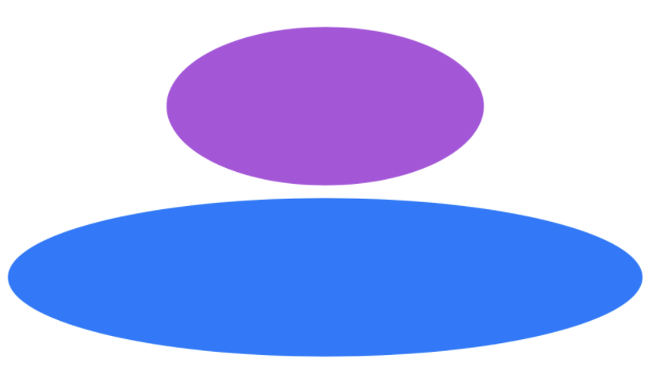
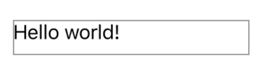

> Navigation: [Technologies](../../technologies.md) · [SwiftUI](../../swiftui.md) · [View](../view.md)

# frame(width:height:alignment:)

<sub>Instance Method</sub>

Positions this view within an invisible frame with the specified size.

<sub>iOS, iPadOS, Mac Catalyst, macOS, tvOS, visionOS, watchOS</sub>

```swift
nonisolated func frame(width: CGFloat? = nil, height: CGFloat? = nil, alignment: Alignment = .center) -> some View

```

## Parameters

- `width` — A fixed width for the resulting view. If `width` is `nil`, the resulting view assumes this view’s sizing behavior.

- `height` — A fixed height for the resulting view. If `height` is `nil`, the resulting view assumes this view’s sizing behavior.

- `alignment` — The alignment of this view inside the resulting frame. Note that most alignment values have no apparent effect when the size of the frame happens to match that of this view.

## Return Value

A view with fixed dimensions of `width` and `height`, for the parameters that are non-`nil`.

## Discussion

Use this method to specify a fixed size for a view’s width, height, or both. If you only specify one of the dimensions, the resulting view assumes this view’s sizing behavior in the other dimension.

For example, the following code lays out an ellipse in a fixed 200 by 100 frame. Because a shape always occupies the space offered to it by the layout system, the first ellipse is 200x100 points. The second ellipse is laid out in a frame with only a fixed height, so it occupies that height, and whatever width the layout system offers to its parent.

```swift
VStack {
    Ellipse()
        .fill(Color.purple)
        .frame(width: 200, height: 100)
    Ellipse()
        .fill(Color.blue)
        .frame(height: 100)
}
```



`The alignment` parameter specifies this view’s alignment within the frame.

```swift
Text("Hello world!")
    .frame(width: 200, height: 30, alignment: .topLeading)
    .border(Color.gray)
```

In the example above, the text is positioned at the top, leading corner of the frame. If the text is taller than the frame, its bounds may extend beyond the bottom of the frame’s bounds.



## See Also

### Influencing a view’s size

- [frame(depth:alignment:)](<frame(depth_alignment_).md>) — Positions this view within an invisible frame with the specified depth.
- [frame(minWidth:idealWidth:maxWidth:minHeight:idealHeight:maxHeight:alignment:)](<frame(minwidth_idealwidth_maxwidth_minheight_idealheight_maxheight_alignment_).md>) — Positions this view within an invisible frame having the specified size constraints.
- [frame(minDepth:idealDepth:maxDepth:alignment:)](<frame(mindepth_idealdepth_maxdepth_alignment_).md>) — Positions this view within an invisible frame having the specified depth constraints.
- [containerRelativeFrame(_:alignment:)](<containerrelativeframe(__alignment_).md>) — Positions this view within an invisible frame with a size relative to the nearest container.
- [containerRelativeFrame(_:alignment:_:)](<containerrelativeframe(__alignment___).md>) — Positions this view within an invisible frame with a size relative to the nearest container.
- [containerRelativeFrame(_:count:span:spacing:alignment:)](<containerrelativeframe(__count_span_spacing_alignment_).md>) — Positions this view within an invisible frame with a size relative to the nearest container.
- [fixedSize()](<fixedsize().md>) — Fixes this view at its ideal size.
- [fixedSize(horizontal:vertical:)](<fixedsize(horizontal_vertical_).md>) — Fixes this view at its ideal size in the specified dimensions.
- [layoutPriority(_:)](<layoutpriority(__).md>) — Sets the priority by which a parent layout should apportion space to this child.
