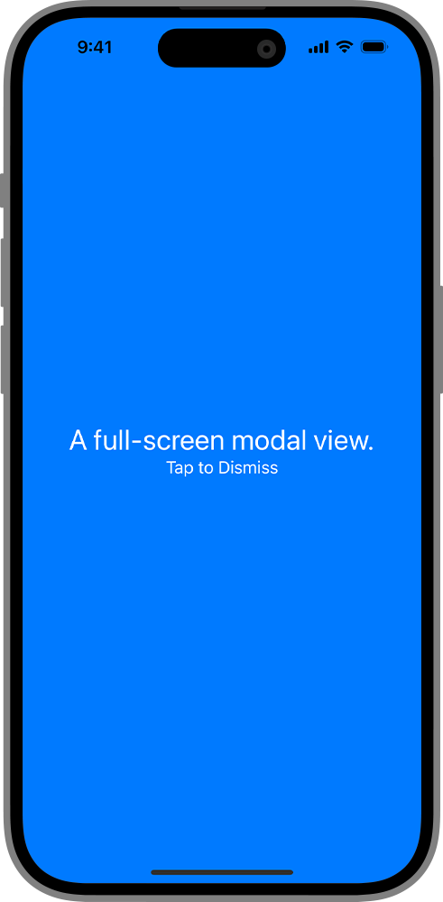

> Navigation: [Technologies](../../technologies.md) · [SwiftUI](../../swiftui.md) · [View](../view.md)

# fullScreenCover(isPresented:onDismiss:content:)

<sub>Instance Method</sub>

Presents a modal view that covers as much of the screen as possible when binding to a Boolean value you provide is true.

<sub>iOS, iPadOS, Mac Catalyst, tvOS, visionOS, watchOS</sub>

```swift
nonisolated func fullScreenCover<Content>(isPresented: Binding<Bool>, onDismiss: (() -> Void)? = nil, @ContentBuilder content: @escaping () -> Content) -> some View where Content : View

```

## Parameters

- `isPresented` — A binding to a Boolean value that determines whether to present the sheet.

- `onDismiss` — The closure to execute when dismissing the modal view.

- `content` — A closure that returns the content of the modal view.

## Discussion

Use this method to show a modal view that covers as much of the screen as possible. The example below displays a custom view when the user toggles the value of the `isPresenting` binding:

```swift
struct FullScreenCoverPresentedOnDismiss: View {
    @State private var isPresenting = false
    var body: some View {
        Button("Present Full-Screen Cover") {
            isPresenting.toggle()
        }
        .fullScreenCover(isPresented: $isPresenting,
                         onDismiss: didDismiss) {
            VStack {
                Text("A full-screen modal view.")
                    .font(.title)
                Text("Tap to Dismiss")
            }
            .onTapGesture {
                isPresenting.toggle()
            }
            .foregroundColor(.white)
            .frame(maxWidth: .infinity,
                   maxHeight: .infinity)
            .background(Color.blue)
            .ignoresSafeArea(edges: .all)
        }
    }

    func didDismiss() {
        // Handle the dismissing action.
    }
}
```



## See Also

### Showing a sheet, cover, or popover

- [sheet(isPresented:onDismiss:content:)](<sheet(ispresented_ondismiss_content_).md>) — Presents a sheet when a binding to a Boolean value that you provide is true.
- [sheet(item:onDismiss:content:)](<sheet(item_ondismiss_content_).md>) — Presents a sheet using the given item as a data source for the sheet’s content.
- [fullScreenCover(item:onDismiss:content:)](<fullscreencover(item_ondismiss_content_).md>) — Presents a modal view that covers as much of the screen as possible using the binding you provide as a data source for the sheet’s content.
- [popover(item:attachmentAnchor:arrowEdge:content:)](<popover(item_attachmentanchor_arrowedge_content_).md>) — Presents a popover using the given item as a data source for the popover’s content.
- [popover(isPresented:attachmentAnchor:arrowEdge:content:)](<popover(ispresented_attachmentanchor_arrowedge_content_).md>) — Presents a popover when a given condition is true.
- [PopoverAttachmentAnchor](../popoverattachmentanchor.md) — An attachment anchor for a popover.
