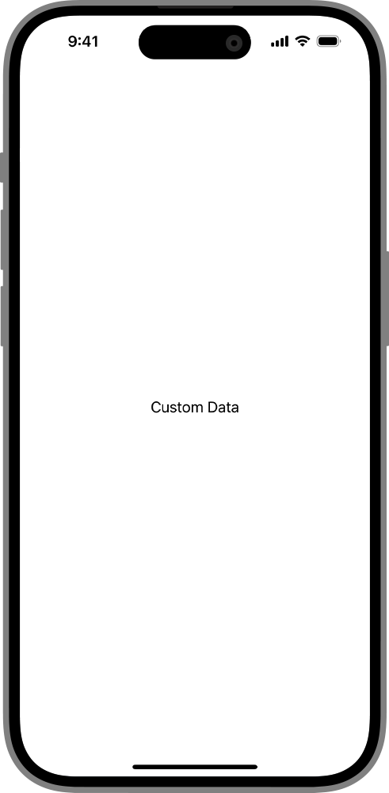

> Navigation: [Technologies](../../technologies.md) · [SwiftUI](../../swiftui.md) · [View](../view.md)

# fullScreenCover(item:onDismiss:content:)

<sub>Instance Method</sub>

Presents a modal view that covers as much of the screen as possible using the binding you provide as a data source for the sheet’s content.

<sub>iOS, iPadOS, Mac Catalyst, tvOS, visionOS, watchOS</sub>

```swift
nonisolated func fullScreenCover<Item, Content>(item: Binding<Item?>, onDismiss: (() -> Void)? = nil, @ContentBuilder content: @escaping (Item) -> Content) -> some View where Item : Identifiable, Content : View

```

## Parameters

- `item` — A binding to an optional source of truth for the sheet. When `item` is non-`nil`, the system passes the contents to the modifier’s closure. You display this content in a sheet that you create that the system displays to the user. If `item` changes, the system dismisses the currently displayed sheet and replaces it with a new one using the same process.

- `onDismiss` — The closure to execute when dismissing the modal view.

- `content` — A closure returning the content of the modal view.

## Discussion

Use this method to display a modal view that covers as much of the screen as possible. In the example below a custom structure — `CoverData` — provides data for the full-screen view to display in the `content` closure when the user clicks or taps the “Present Full-Screen Cover With Data” button:

```swift
struct FullScreenCoverItemOnDismissContent: View {
    @State private var coverData: CoverData?

    var body: some View {
        Button("Present Full-Screen Cover With Data") {
            coverData = CoverData(body: "Custom Data")
        }
        .fullScreenCover(item: $coverData,
                         onDismiss: didDismiss) { details in
            VStack(spacing: 20) {
                Text("\(details.body)")
            }
            .onTapGesture {
                coverData = nil
            }
        }
    }

    func didDismiss() {
        // Handle the dismissing action.
    }

}

struct CoverData: Identifiable {
    var id: String {
        return body
    }
    let body: String
}
```



## See Also

### Showing a sheet, cover, or popover

- [sheet(isPresented:onDismiss:content:)](<sheet(ispresented_ondismiss_content_).md>) — Presents a sheet when a binding to a Boolean value that you provide is true.
- [sheet(item:onDismiss:content:)](<sheet(item_ondismiss_content_).md>) — Presents a sheet using the given item as a data source for the sheet’s content.
- [fullScreenCover(isPresented:onDismiss:content:)](<fullscreencover(ispresented_ondismiss_content_).md>) — Presents a modal view that covers as much of the screen as possible when binding to a Boolean value you provide is true.
- [popover(item:attachmentAnchor:arrowEdge:content:)](<popover(item_attachmentanchor_arrowedge_content_).md>) — Presents a popover using the given item as a data source for the popover’s content.
- [popover(isPresented:attachmentAnchor:arrowEdge:content:)](<popover(ispresented_attachmentanchor_arrowedge_content_).md>) — Presents a popover when a given condition is true.
- [PopoverAttachmentAnchor](../popoverattachmentanchor.md) — An attachment anchor for a popover.
