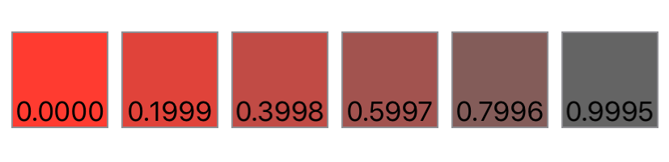

> Navigation: [Technologies](../../technologies.md) · [SwiftUI](../../swiftui.md) · [View](../view.md)

# grayscale(_:)

<sub>Instance Method</sub>

Adds a grayscale effect to this view.

<sub>iOS, iPadOS, Mac Catalyst, macOS, tvOS, visionOS, watchOS</sub>

```swift
nonisolated func grayscale(_ amount: Double) -> some View

```

## Parameters

- `amount` — The intensity of grayscale to apply from 0.0 to less than 1.0. Values closer to 0.0 are more colorful, and values closer to 1.0 are less colorful.

## Return Value

A view that adds a grayscale effect to this view.

## Discussion

A grayscale effect reduces the intensity of colors in this view.

The example below shows a series of red squares with their grayscale effect increasing from 0 (reddest) to 99% (fully desaturated) in approximate 20% increments:

```swift
struct Saturation: View {
    var body: some View {
        HStack {
            ForEach(0..<6) {
                Color.red.frame(width: 60, height: 60, alignment: .center)
                    .grayscale(Double($0) * 0.1999)
                    .overlay(Text("\(Double($0) * 0.1999 * 100, specifier: "%.4f")%"),
                             alignment: .bottom)
                    .border(Color.gray)
            }
        }
    }
}
```



## See Also

### Transforming colors

- [brightness(_:)](<brightness(__).md>) — Brightens this view by the specified amount.
- [contrast(_:)](<contrast(__).md>) — Sets the contrast and separation between similar colors in this view.
- [colorInvert()](<colorinvert().md>) — Inverts the colors in this view.
- [colorMultiply(_:)](<colormultiply(__).md>) — Adds a color multiplication effect to this view.
- [saturation(_:)](<saturation(__).md>) — Adjusts the color saturation of this view.
- [hueRotation(_:)](<huerotation(__).md>) — Applies a hue rotation effect to this view.
- [luminanceToAlpha()](<luminancetoalpha().md>) — Adds a luminance to alpha effect to this view.
- [materialActiveAppearance(_:)](<materialactiveappearance(__).md>) — Sets an explicit active appearance for materials in this view.
- [materialActiveAppearance](../environmentvalues/materialactiveappearance.md) — The behavior materials should use for their active state, defaulting to `automatic`.
- [MaterialActiveAppearance](../materialactiveappearance.md) — The behavior for how materials appear active and inactive.
