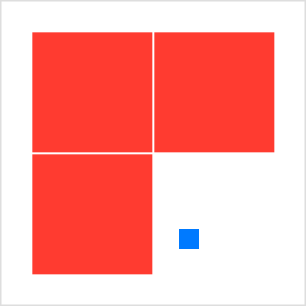
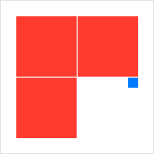
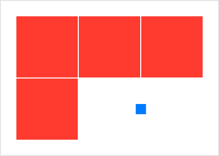

> Navigation: [Technologies](../../technologies.md) · [SwiftUI](../../swiftui.md) · [View](../view.md)

# gridCellAnchor(_:)

<sub>Instance Method</sub>

Specifies a custom alignment anchor for a view that acts as a grid cell.

<sub>iOS, iPadOS, Mac Catalyst, macOS, tvOS, visionOS, watchOS</sub>

```swift
nonisolated func gridCellAnchor(_ anchor: UnitPoint) -> some View

```

## Parameters

- `anchor` — The unit point that defines how to align the view within the bounds of its grid cell.

## Return Value

A view that uses the specified anchor point to align its content.

## Discussion

Grids, like stacks and other layout containers, perform most alignment operations using alignment guides. The grid moves the contents of each cell in a row in the y direction until the specified [VerticalAlignment](../verticalalignment.md) guide of each view in the row aligns with the same guide of all the other views in the row. Similarly, the grid aligns the [HorizontalAlignment](../horizontalalignment.md) guides of views in a column by adjusting views in the x direction. See the guide types for more information about typical SwiftUI alignment operations.

When you use the `gridCellAnchor(_:)` modifier on a view in a grid, the grid changes to an anchor-based alignment strategy for the associated cell. With anchor alignment, the grid projects a [UnitPoint](../unitpoint.md) that you specify onto both the view and the cell, and aligns the two projections. For example, consider the following grid:

```swift
Grid(horizontalSpacing: 1, verticalSpacing: 1) {
    GridRow {
        Color.red.frame(width: 60, height: 60)
        Color.red.frame(width: 60, height: 60)
    }
    GridRow {
        Color.red.frame(width: 60, height: 60)
        Color.blue.frame(width: 10, height: 10)
            .gridCellAnchor(UnitPoint(x: 0.25, y: 0.75))
    }
}
```

The grid creates red reference squares in the first row and column to establish row and column sizes. Without the anchor modifier, the blue marker in the remaining cell would appear at the center of its cell, because of the grid’s default [center](../alignment/center.md) alignment. With the anchor modifier shown in the code above, the grid aligns the one quarter point of the marker with the one quarter point of its cell in the x direction, as measured from the origin at the top left of the cell. The grid also aligns the three quarters point of the marker with the three quarters point of the cell in the y direction:



[UnitPoint](../unitpoint.md) defines many convenience points that correspond to the typical alignment guides, which you can use as well. For example, you can use [topTrailing](../unitpoint/toptrailing.md) to align the top and trailing edges of a view in a cell with the top and trailing edges of the cell:

```swift
Color.blue.frame(width: 10, height: 10)
    .gridCellAnchor(.topTrailing)
```



Applying the anchor-based alignment strategy to a single cell doesn’t affect the alignment strategy that the grid uses on other cells.

### Anchor alignment for merged cells

If you use the [gridCellColumns(_:)](<gridcellcolumns(__).md>) modifier to cause a cell to span more than one column, or if you place a view in a grid outside of a row so that the view spans the entire grid, the grid automatically converts its vertical and horizontal alignment guides to the unit point equivalent for the merged cell, and uses an anchor-based approach for that cell. For example, the following grid places the marker at the center of the merged cell by converting the grid’s default [center](../alignment/center.md) alignment guide to a [center](../unitpoint/center.md) anchor for the blue marker in the merged cell:

```swift
Grid(alignment: .center, horizontalSpacing: 1, verticalSpacing: 1) {
    GridRow {
        Color.red.frame(width: 60, height: 60)
        Color.red.frame(width: 60, height: 60)
        Color.red.frame(width: 60, height: 60)
    }
    GridRow {
        Color.red.frame(width: 60, height: 60)
        Color.blue.frame(width: 10, height: 10)
            .gridCellColumns(2)
    }
}
```

The grid makes this conversion in part to avoid ambiguity. Each column has its own horizontal guide, and it isn’t clear which of these a cell that spans multiple columns should align with. Further, in the example above, neither of the center alignment guides for the second or third column would provide the expected behavior, which is to center the marker in the merged cell. Anchor alignment provides this behavior:



## See Also

### Statically arranging views in two dimensions

- [Grid](../grid.md) — A container view that arranges other views in a two dimensional layout.
- [GridRow](../gridrow.md) — A horizontal row in a two dimensional grid container.
- [gridCellColumns(_:)](<gridcellcolumns(__).md>) — Tells a view that acts as a cell in a grid to span the specified number of columns.
- [gridCellUnsizedAxes(_:)](<gridcellunsizedaxes(__).md>) — Asks grid layouts not to offer the view extra size in the specified axes.
- [gridColumnAlignment(_:)](<gridcolumnalignment(__).md>) — Overrides the default horizontal alignment of the grid column that the view appears in.
