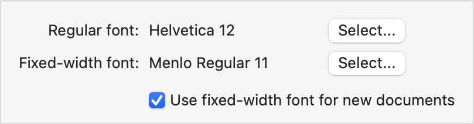

> Navigation: [Technologies](../../technologies.md) · [SwiftUI](../../swiftui.md) · [View](../view.md)

# gridCellColumns(_:)

<sub>Instance Method</sub>

Tells a view that acts as a cell in a grid to span the specified number of columns.

<sub>iOS, iPadOS, Mac Catalyst, macOS, tvOS, visionOS, watchOS</sub>

```swift
nonisolated func gridCellColumns(_ count: Int) -> some View

```

## Parameters

- `count` — The number of columns that the view should consume when placed in a grid row.

## Return Value

A view that occupies the specified number of columns in a grid row.

## Discussion

By default, each view that you put into the content closure of a [GridRow](../gridrow.md) corresponds to exactly one column of the grid. Apply the `gridCellColumns(_:)` modifier to a view that you want to span more than one column, as in the following example of a typical macOS configuration view:

```swift
Grid(alignment: .leadingFirstTextBaseline) {
    GridRow {
        Text("Regular font:")
            .gridColumnAlignment(.trailing)
        Text("Helvetica 12")
        Button("Select...") { }
    }
    GridRow {
        Text("Fixed-width font:")
        Text("Menlo Regular 11")
        Button("Select...") { }
    }
    GridRow {
        Color.clear
            .gridCellUnsizedAxes([.vertical, .horizontal])
        Toggle("Use fixed-width font for new documents", isOn: $isOn)
            .gridCellColumns(2) // Span two columns.
    }
}
```

The [Toggle](../toggle.md) in the example above spans the column that contains the font names and the column that contains the buttons:



> [!important] Important
> When you tell a cell to span multiple columns, the grid changes the merged cell to use anchor alignment, rather than the usual alignment guides. For information about the behavior of anchor alignment, see [gridCellAnchor(_:)](<gridcellanchor(__).md>).

As a convenience you can cause a view to span all of the [Grid](../grid.md) columns by placing the view directly in the content closure of the [Grid](../grid.md), outside of a [GridRow](../gridrow.md), and omitting the modifier. To do the opposite and include more than one view in a cell, group the views using an appropriate layout container, like an [HStack](../hstack.md), so that they act as a single view.

## See Also

### Statically arranging views in two dimensions

- [Grid](../grid.md) — A container view that arranges other views in a two dimensional layout.
- [GridRow](../gridrow.md) — A horizontal row in a two dimensional grid container.
- [gridCellAnchor(_:)](<gridcellanchor(__).md>) — Specifies a custom alignment anchor for a view that acts as a grid cell.
- [gridCellUnsizedAxes(_:)](<gridcellunsizedaxes(__).md>) — Asks grid layouts not to offer the view extra size in the specified axes.
- [gridColumnAlignment(_:)](<gridcolumnalignment(__).md>) — Overrides the default horizontal alignment of the grid column that the view appears in.
