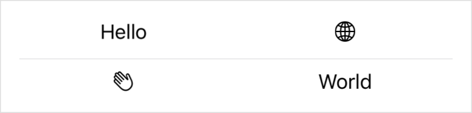

> Navigation: [Technologies](../../technologies.md) · [SwiftUI](../../swiftui.md) · [View](../view.md)

# gridCellUnsizedAxes(_:)

<sub>Instance Method</sub>

Asks grid layouts not to offer the view extra size in the specified axes.

<sub>iOS, iPadOS, Mac Catalyst, macOS, tvOS, visionOS, watchOS</sub>

```swift
nonisolated func gridCellUnsizedAxes(_ axes: Axis.Set) -> some View

```

## Parameters

- `axes` — The dimensions in which the grid shouldn’t offer the view a share of any available space. This prevents a flexible view like a [Spacer](../spacer.md), [Divider](../divider.md), or [Color](../color.md) from defining the size of a row or column.

## Return Value

A view that doesn’t ask an enclosing grid for extra size in one or more axes.

## Discussion

Use this modifier to prevent a flexible view from taking more space on the specified axes than the other cells in a row or column require. For example, consider the following [Grid](../grid.md) that places a [Divider](../divider.md) between two rows of content:

```swift
Grid {
    GridRow {
        Text("Hello")
        Image(systemName: "globe")
    }
    Divider()
    GridRow {
        Image(systemName: "hand.wave")
        Text("World")
    }
}
```

The text and images all have ideal widths for their content. However, because a divider takes as much space as its parent offers, the grid fills the width of the display, expanding all the other cells to match:



You can prevent the grid from giving the divider more width than the other cells require by adding the modifier with the [Axis.horizontal](../axis/horizontal.md) parameter:

```swift
Divider()
    .gridCellUnsizedAxes(.horizontal)
```

This restores the grid to the width that it would have without the divider:


## See Also

### Statically arranging views in two dimensions

- [Grid](../grid.md) — A container view that arranges other views in a two dimensional layout.
- [GridRow](../gridrow.md) — A horizontal row in a two dimensional grid container.
- [gridCellColumns(_:)](<gridcellcolumns(__).md>) — Tells a view that acts as a cell in a grid to span the specified number of columns.
- [gridCellAnchor(_:)](<gridcellanchor(__).md>) — Specifies a custom alignment anchor for a view that acts as a grid cell.
- [gridColumnAlignment(_:)](<gridcolumnalignment(__).md>) — Overrides the default horizontal alignment of the grid column that the view appears in.
