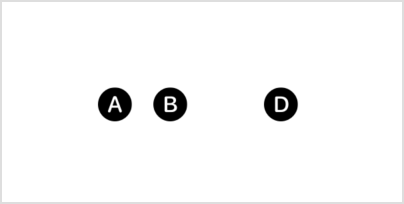
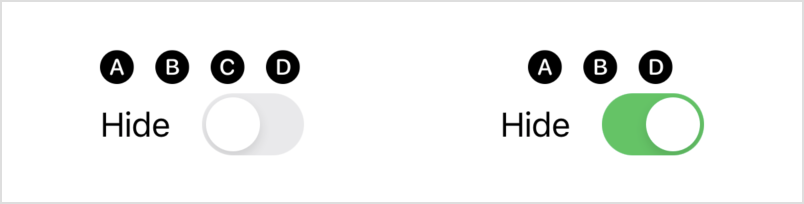

> Navigation: [Technologies](../../technologies.md) · [SwiftUI](../../swiftui.md) · [View](../view.md)

# hidden()

<sub>Instance Method</sub>

Hides this view unconditionally.

<sub>iOS, iPadOS, Mac Catalyst, macOS, tvOS, visionOS, watchOS</sub>

```swift
nonisolated func hidden() -> some View

```

## Return Value

A hidden view.

## Discussion

Hidden views are invisible and can’t receive or respond to interactions. However, they do remain in the view hierarchy and affect layout. Use this modifier if you want to include a view for layout purposes, but don’t want it to display.

```swift
HStack {
    Image(systemName: "a.circle.fill")
    Image(systemName: "b.circle.fill")
    Image(systemName: "c.circle.fill")
        .hidden()
    Image(systemName: "d.circle.fill")
}
```

The third circle takes up space, because it’s still present, but SwiftUI doesn’t draw it onscreen.



If you want to conditionally include a view in the view hierarchy, use an `if` statement instead:

```swift
VStack {
    HStack {
        Image(systemName: "a.circle.fill")
        Image(systemName: "b.circle.fill")
        if !isHidden {
            Image(systemName: "c.circle.fill")
        }
        Image(systemName: "d.circle.fill")
    }
    Toggle("Hide", isOn: $isHidden)
}
```

Depending on the current value of the `isHidden` state variable in the example above, controlled by the [Toggle](../toggle.md) instance, SwiftUI draws the circle or completely omits it from the layout.



## See Also

### Hiding views

- [opacity(_:)](<opacity(__).md>) — Sets the transparency of this view.
