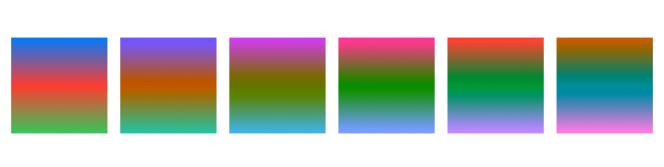

> Navigation: [Technologies](../../technologies.md) · [SwiftUI](../../swiftui.md) · [View](../view.md)

# hueRotation(_:)

<sub>Instance Method</sub>

Applies a hue rotation effect to this view.

<sub>iOS, iPadOS, Mac Catalyst, macOS, tvOS, visionOS, watchOS</sub>

```swift
nonisolated func hueRotation(_ angle: Angle) -> some View

```

## Parameters

- `angle` — The hue rotation angle to apply to the colors in this view.

## Return Value

A view that applies a hue rotation effect to this view.

## Discussion

Use hue rotation effect to shift all of the colors in a view according to the angle you specify.

The example below shows a series of squares filled with a linear gradient. Each square shows the effect of a 36˚ hueRotation (a total of 180˚ across the 5 squares) on the gradient:

```swift
struct HueRotation: View {
    var body: some View {
        HStack {
            ForEach(0..<6) {
                Rectangle()
                    .fill(.linearGradient(
                        colors: [.blue, .red, .green],
                        startPoint: .top, endPoint: .bottom))
                    .hueRotation((.degrees(Double($0 * 36))))
                    .frame(width: 60, height: 60, alignment: .center)
            }
        }
    }
}
```



## See Also

### Transforming colors

- [brightness(_:)](<brightness(__).md>) — Brightens this view by the specified amount.
- [contrast(_:)](<contrast(__).md>) — Sets the contrast and separation between similar colors in this view.
- [colorInvert()](<colorinvert().md>) — Inverts the colors in this view.
- [colorMultiply(_:)](<colormultiply(__).md>) — Adds a color multiplication effect to this view.
- [saturation(_:)](<saturation(__).md>) — Adjusts the color saturation of this view.
- [grayscale(_:)](<grayscale(__).md>) — Adds a grayscale effect to this view.
- [luminanceToAlpha()](<luminancetoalpha().md>) — Adds a luminance to alpha effect to this view.
- [materialActiveAppearance(_:)](<materialactiveappearance(__).md>) — Sets an explicit active appearance for materials in this view.
- [materialActiveAppearance](../environmentvalues/materialactiveappearance.md) — The behavior materials should use for their active state, defaulting to `automatic`.
- [MaterialActiveAppearance](../materialactiveappearance.md) — The behavior for how materials appear active and inactive.
