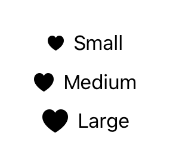

> Navigation: [Technologies](../../technologies.md) · [SwiftUI](../../swiftui.md) · [View](../view.md)

# imageScale(_:)

<sub>Instance Method</sub>

Scales images within the view according to one of the relative sizes available including small, medium, and large images sizes.

<sub>iOS, iPadOS, Mac Catalyst, macOS, tvOS, visionOS, watchOS</sub>

```swift
nonisolated func imageScale(_ scale: Image.Scale) -> some View

```

## Parameters

- `scale` — One of the relative sizes provided by the image scale enumeration.

## Discussion

The example below shows the relative scaling effect. The system renders the image at a relative size based on the available space and configuration options of the image it is scaling.

```swift
VStack {
    HStack {
        Image(systemName: "heart.fill")
            .imageScale(.small)
        Text("Small")
    }
    HStack {
        Image(systemName: "heart.fill")
            .imageScale(.medium)
        Text("Medium")
    }

    HStack {
        Image(systemName: "heart.fill")
            .imageScale(.large)
        Text("Large")
    }
}
```



## See Also

### Configuring an image

- [Fitting images into available space](../fitting-images-into-available-space.md) — Adjust the size and shape of images in your app’s user interface by applying view modifiers.
- [imageScale](../environmentvalues/imagescale.md) — The image scale for this environment.
- [Scale](../image/scale.md) — A scale to apply to vector images relative to text.
- [Orientation](../image/orientation.md) — The orientation of an image.
- [ResizingMode](../image/resizingmode.md) — The modes that SwiftUI uses to resize an image to fit within its containing view.
