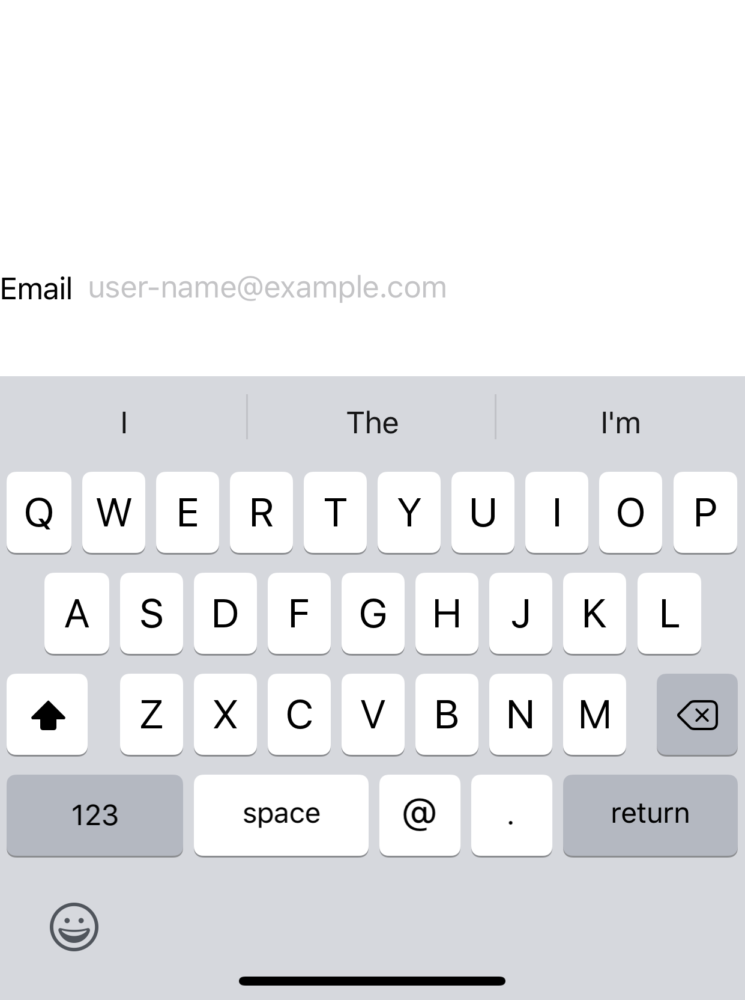

> Navigation: [Technologies](../../technologies.md) · [SwiftUI](../../swiftui.md) · [View](../view.md)

# keyboardType(_:)

<sub>Instance Method</sub>

Sets the keyboard type for this view.

<sub>iOS, iPadOS, Mac Catalyst, tvOS, visionOS</sub>

```swift
nonisolated func keyboardType(_ type: UIKeyboardType) -> some View

```

## Parameters

- `type` — One of the keyboard types defined in the [UIKeyboardType](../../uikit/uikeyboardtype.md) enumeration.

## Discussion

Use `keyboardType(_:)` to specify the keyboard type to use for text entry. A number of different keyboard types are available to meet specialized input needs, such as entering email addresses or phone numbers.

The example below presents a [TextField](../textfield.md) to input an email address. Setting the text field’s keyboard type to `.emailAddress` ensures the user can only enter correctly formatted email addresses.

```swift
TextField("someone@example.com", text: $emailAddress)
    .keyboardType(.emailAddress)
```

There are several different kinds of specialized keyboard types available though the [UIKeyboardType](../../uikit/uikeyboardtype.md) enumeration. To specify the default system keyboard type, use `.default`.



## See Also

### Managing text entry

- [autocorrectionDisabled(_:)](<autocorrectiondisabled(__).md>) — Sets whether to disable autocorrection for this view.
- [autocorrectionDisabled](../environmentvalues/autocorrectiondisabled.md) — A Boolean value that determines whether the view hierarchy has auto-correction enabled.
- [scrollDismissesKeyboard(_:)](<scrolldismisseskeyboard(__).md>) — Configures the behavior in which scrollable content interacts with the software keyboard.
- [textContentType(_:)](<textcontenttype(__).md>) — Sets the text content type for this view, which the system uses to offer suggestions while the user enters text on macOS.
- [textInputAutocapitalization(_:)](<textinputautocapitalization(__).md>) — Sets how often the shift key in the keyboard is automatically enabled.
- [TextInputAutocapitalization](../textinputautocapitalization.md) — The kind of autocapitalization behavior applied during text input.
- [textInputBorderShape(_:)](<textinputbordershape(__).md>) — Sets the border shape for text input controls in the view hierarchy. _(beta)_
- [TextInputBorderShape](../textinputbordershape.md) — A shape used to draw the border of a text input control. _(beta)_
- [textInputCompletion(_:)](<textinputcompletion(__).md>) — Associates a fully formed string with the value of this view when used as a text input suggestion
- [textInputSuggestions(_:)](<textinputsuggestions(__).md>) — Configures the text input suggestions for this view.
- [textInputSuggestions(_:content:)](<textinputsuggestions(__content_).md>) — Configures the text input suggestions for this view.
- [textInputSuggestions(_:id:content:)](<textinputsuggestions(__id_content_).md>) — Configures the text input suggestions for this view.
- [textContentType(_:)](<textcontenttype(__)-4dqqb.md>) — Sets the text content type for this view, which the system uses to offer suggestions while the user enters text on a watchOS device.
- [textContentType(_:)](<textcontenttype(__)-6fic1.md>) — Sets the text content type for this view, which the system uses to offer suggestions while the user enters text on macOS.
- [textContentType(_:)](<textcontenttype(__)-ufdv.md>) — Sets the text content type for this view, which the system uses to offer suggestions while the user enters text on an iOS or tvOS device.
