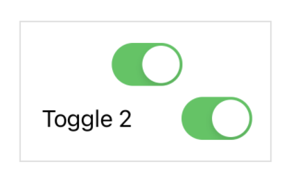

> Navigation: [Technologies](../../technologies.md) · [SwiftUI](../../swiftui.md) · [View](../view.md)

# labelsVisibility(_:)

<sub>Instance Method</sub>

Controls the visibility of labels of any controls contained within this view.

<sub>iOS, iPadOS, Mac Catalyst, macOS, tvOS, visionOS, watchOS</sub>

```swift
nonisolated func labelsVisibility(_ visibility: Visibility) -> some View

```

## Discussion

Use this modifier when you want to omit a label from one or more labeled content in your user interface. For example, the first [Toggle](../toggle.md) in the following example hides its label:

```swift
VStack {
    Toggle(isOn: $toggle1) {
        Text("Toggle 1")
    }
    .labelsVisibility(.hidden)

    Toggle(isOn: $toggle2) {
        Text("Toggle 2")
    }
}
```

The [VStack](../vstack.md) in the example above centers the first toggle’s control element in the available space, while it centers the second toggle’s combined label and control element:



Always provide a label for controls, even when you hide the label, because SwiftUI uses labels for other purposes, including accessibility.

On iOS, a `Picker` within a `Menu` hides its label by default. You can use this modifier to explicitly show the label in that context:

```swift
Menu {
    Picker("Flavor", selection: $selectedFlavor) {
        Text("Chocolate").tag(Flavor.chocolate)
        Text("Vanilla").tag(Flavor.vanilla)
        Text("Strawberry").tag(Flavor.strawberry)
    }
    .labelsVisibility(.visible)
}
```

> [!note] Note
> This modifier doesn’t work for all labels. It applies to [LabeledContent](../labeledcontent.md) elements, including controls like [Picker](../picker.md) and [Toggle](../toggle.md), but not to controls like a bordered button where the label is inside the button’s border.

## See Also

### Hiding system elements

- [labelsHidden()](<labelshidden().md>) — Hides the labels of any controls contained within this view.
- [labelsVisibility](../environmentvalues/labelsvisibility.md) — The labels visibility set by [labelsVisibility(_:)](<labelsvisibility(__).md>).
- [menuIndicator(_:)](<menuindicator(__).md>) — Sets the menu indicator visibility for controls within this view.
- [statusBarHidden(_:)](<statusbarhidden(__).md>) — Sets the visibility of the status bar. _(deprecated)_
- [persistentSystemOverlays(_:)](<persistentsystemoverlays(__).md>) — Sets the preferred visibility of the non-transient system views overlaying the app.
- [Visibility](../visibility.md) — The visibility of a UI element, chosen automatically based on the platform, current context, and other factors.
