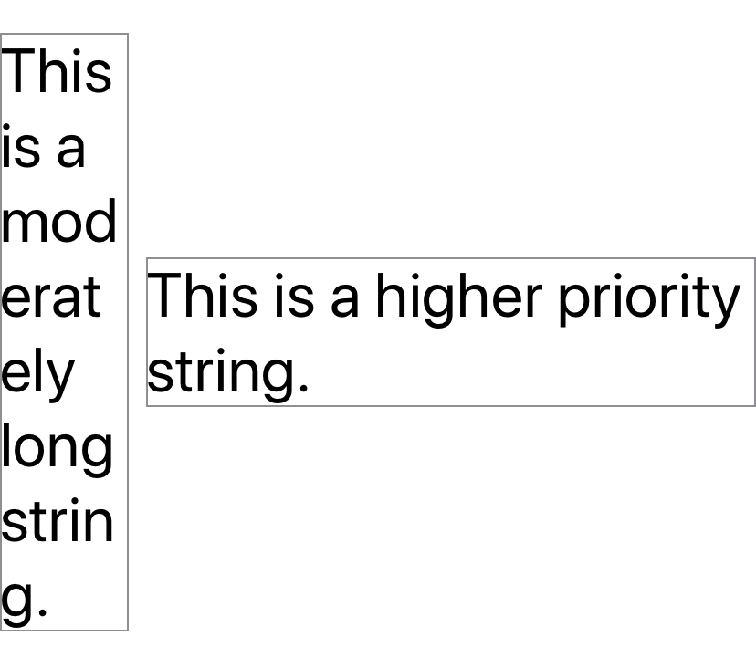

> Navigation: [Technologies](../../technologies.md) · [SwiftUI](../../swiftui.md) · [View](../view.md)

# layoutPriority(_:)

<sub>Instance Method</sub>

Sets the priority by which a parent layout should apportion space to this child.

<sub>iOS, iPadOS, Mac Catalyst, macOS, tvOS, visionOS, watchOS</sub>

```swift
nonisolated func layoutPriority(_ value: Double) -> some View

```

## Parameters

- `value` — The priority by which a parent layout apportions space to the child.

## Discussion

Views typically have a default priority of `0` which causes space to be apportioned evenly to all sibling views. Raising a view’s layout priority encourages the higher priority view to shrink later when the group is shrunk and stretch sooner when the group is stretched.

```swift
HStack {
    Text("This is a moderately long string.")
        .font(.largeTitle)
        .border(Color.gray)

    Spacer()

    Text("This is a higher priority string.")
        .font(.largeTitle)
        .layoutPriority(1)
        .border(Color.gray)
}
```

In the example above, the first [Text](../text.md) element has the default priority `0` which causes its view to shrink dramatically due to the higher priority of the second [Text](../text.md) element, even though all of their other attributes (font, font size and character count) are the same.



A parent layout offers the child views with the highest layout priority all the space offered to the parent minus the minimum space required for all its lower-priority children.

## See Also

### Influencing a view’s size

- [frame(width:height:alignment:)](<frame(width_height_alignment_).md>) — Positions this view within an invisible frame with the specified size.
- [frame(depth:alignment:)](<frame(depth_alignment_).md>) — Positions this view within an invisible frame with the specified depth.
- [frame(minWidth:idealWidth:maxWidth:minHeight:idealHeight:maxHeight:alignment:)](<frame(minwidth_idealwidth_maxwidth_minheight_idealheight_maxheight_alignment_).md>) — Positions this view within an invisible frame having the specified size constraints.
- [frame(minDepth:idealDepth:maxDepth:alignment:)](<frame(mindepth_idealdepth_maxdepth_alignment_).md>) — Positions this view within an invisible frame having the specified depth constraints.
- [containerRelativeFrame(_:alignment:)](<containerrelativeframe(__alignment_).md>) — Positions this view within an invisible frame with a size relative to the nearest container.
- [containerRelativeFrame(_:alignment:_:)](<containerrelativeframe(__alignment___).md>) — Positions this view within an invisible frame with a size relative to the nearest container.
- [containerRelativeFrame(_:count:span:spacing:alignment:)](<containerrelativeframe(__count_span_spacing_alignment_).md>) — Positions this view within an invisible frame with a size relative to the nearest container.
- [fixedSize()](<fixedsize().md>) — Fixes this view at its ideal size.
- [fixedSize(horizontal:vertical:)](<fixedsize(horizontal_vertical_).md>) — Fixes this view at its ideal size in the specified dimensions.
