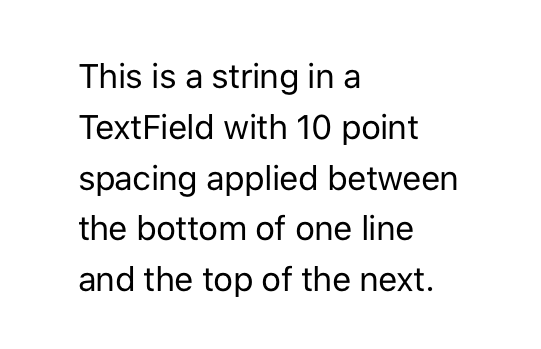

> Navigation: [Technologies](../../technologies.md) · [SwiftUI](../../swiftui.md) · [View](../view.md)

# lineSpacing(_:)

<sub>Instance Method</sub>

Sets the amount of space between lines of text in this view.

<sub>iOS, iPadOS, Mac Catalyst, macOS, tvOS, visionOS, watchOS</sub>

```swift
nonisolated func lineSpacing(_ lineSpacing: CGFloat) -> some View

```

## Parameters

- `lineSpacing` — The amount of space between the bottom of one line and the top of the next line in points.

## Discussion

Use `lineSpacing(_:)` to set the amount of spacing from the bottom of one line to the top of the next for text elements in the view.

In the [Text](../text.md) view in the example below, 10 points separate the bottom of one line to the top of the next as the text field wraps inside this view. Applying `lineSpacing(_:)` to a view hierarchy applies the line spacing to all text elements contained in the view.

```swift
Text("This is a string in a TextField with 10 point spacing applied between the bottom of one line and the top of the next.")
    .frame(width: 200, height: 200, alignment: .leading)
    .lineSpacing(10)
```



## See Also

### Formatting multiline text

- [lineSpacing](../environmentvalues/linespacing.md) — The distance in points between the bottom of one line fragment and the top of the next.
- [multilineTextAlignment(_:)](<multilinetextalignment(__).md>) — Sets the alignment of a text view that contains multiple lines of text.
- [multilineTextAlignment](../environmentvalues/multilinetextalignment.md) — An environment value that indicates how a text view aligns its lines when the content wraps or contains newlines.
